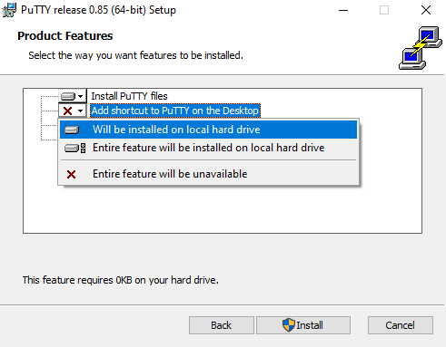
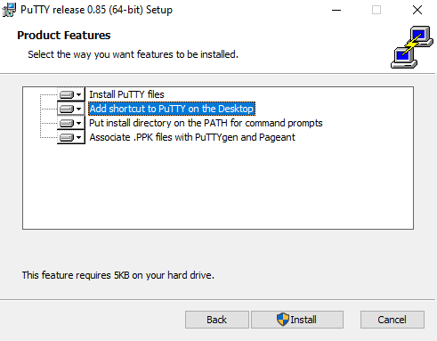
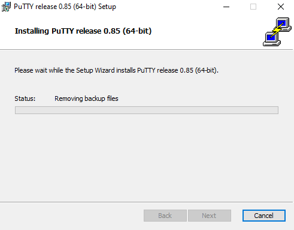
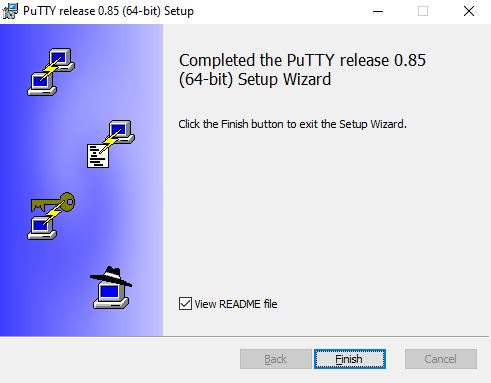
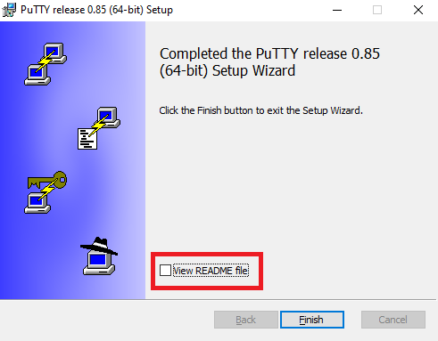
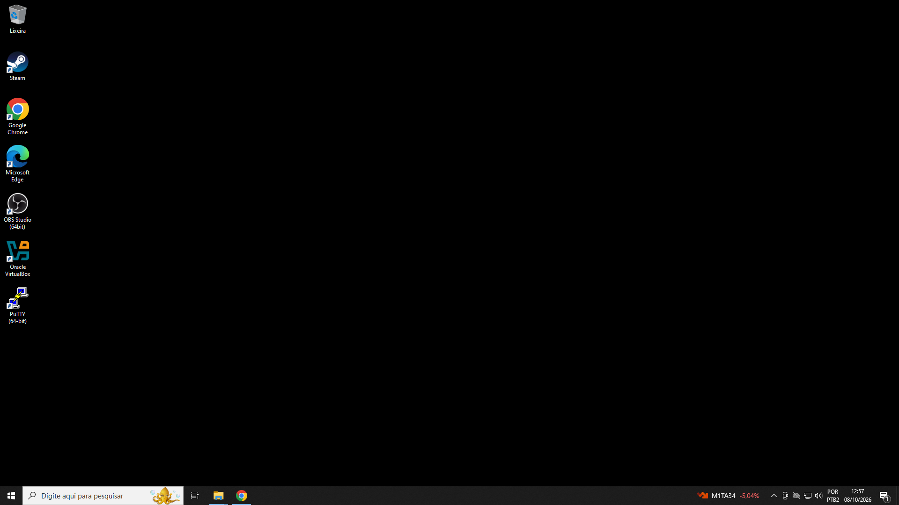
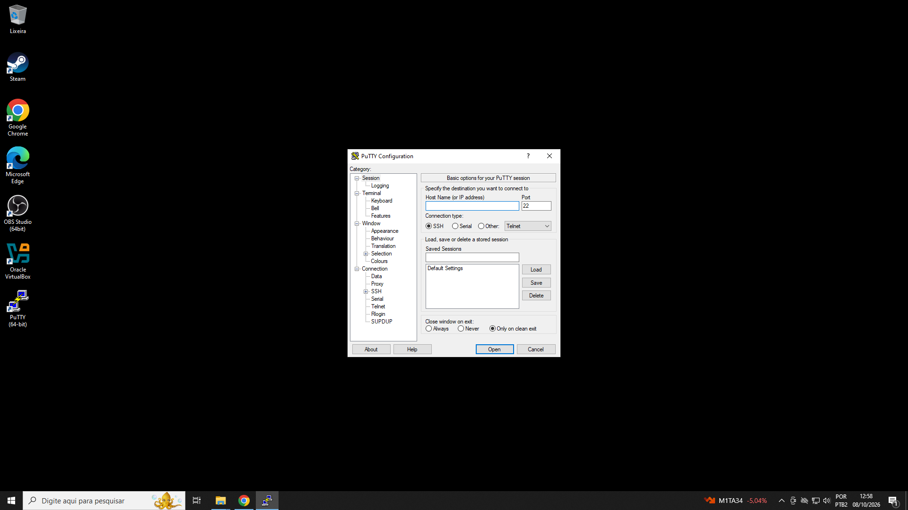

# Acesso SSH por chave

  

## 1. Instalação do PuTTY

O PuTTY será utilizado como cliente SSH no Windows para acessar a máquina virtual rodando o Ubuntu Server.

### Site oficial

O download do PuTTY foi realizado através do site oficial do projeto ( https://putty.software )

<i>(Imagem 01: Site oficial PuTTY)</i>

  

### Download

Após clicar no link indicado no passo anterior, o site oficial do PuTTY redireciona para o link =

( https://www.chiark.greenend.org.uk/~sgtatham/putty/latest.html )

Este site é do servidor original hospedado pelo criador e principal desenvolvedor do software, Simon Tatham.

<i>(Imagem 02: Página oficial de download do PuTTY)</i>

  

Na página de download, o arquivo executável com a instalação padrão fica em Package Files, neste laboratório utilizaremos a versão 64-bit x86.

<i>(Imagem 03: Package Files / PuTTY)</i>

  

#### Alternative Binary Files (Putty Portável)

Existe a versão "*portable*" (portável) do PuTTY, é possível fazer o download desta versão na seção Alternative Binary Files.

<i>(Imagem 04: Alternative Binary Files / PuTTY)</i>

  

#### Local do executável PuTTY 

O Windows geralmente salva os arquivos baixados da internet na pasta "Downloads", acesse o local onde foi salvo o instalador do PuTTY e execute o programa para iniciar o processo de instalação.

<i>(Imagem 05: Local onde foi salvo o instalador do PuTTY)</i>

  

### Instalação

Ao executar o instalador do PuTTY, o Windows pode solicitar uma confirmação para continuar, confirme para prosseguir.

Inicialmente, o instalador exibe a tela de boas vindas. Clique em "*Next*" (Avançar) para começar este processo.

  

<i>(Imagem 06: Tela de boas vindas / Instalando o PuTTY)</i>

  

### Local de instalação

O próximo passo é definir o local de instalação do PuTTY, neste exemplo vamos instalar no diretório padrão ( C:\Program Files\PuTTY\ ), sem fazer nenhuma alteração.

Clique em "*Next*" (Avançar) para continuar.

  

<i>(Imagem 07: Local de instalação do PuTTY)</i>

  

### Product Features / Recursos do Produto

Agora o instalador do PuTTY vai apresentar a seção "*Product Features*" (Recursos do Produto), aqui podemos escolher quais componentes e ferramentas extras do PuTTY desejamos instalar ou ativar no computador.

  

<i>(Imagem 08: Recursos Extras / Instalação do PuTTY)</i>

  

### Adicionando atalho na Área de Trabalho

Antes de avançarmos para a próxima etapa, vamos habilitar o recurso para adicionar um atalho do PuTTY a área de trabalho do Windows.

Clique na opção "*Add shortcut to PuTTY on the Desktop*" (Adicionar atalho para o PuTTY na área de trabalho), em seguida selecione a opção "*Will be installed on local hard drive*" (Será instalado no disco rígido local), conforme a imagem abaixo.

  

<i>(Imagem 09: Recursos Extras / Adicionando ícone do PuTTY na área de trabalho)</i>

  

Depois de selecionar o recurso para criar um ícone do PuTTY na área de trabalho, clique em "*Install*" (Instalar) para iniciar o processo.

  

<i>(Imagem 10: Recursos Extras / Ícone do PuTTY na área de trabalho)</i>

  

### Confirmação para iniciar

O Windows nesta etapa, após clicar para instalar o PuTTY, pode solicitar a confirmação para continuar. Caso a janela do Controle de Conta de Usuário (UAC) apareça, basta clicar em Sim para autorizar o instalador.

  

### Instalando...

Agora, aguarde enquanto o instalador copia os arquivos para o seu computador. Assim que a barra de progresso estiver cheia, a tela final será exibida automaticamente.

  

<i>(Imagem 11: Instalando o PuTTY)</i>

  

### Instalação finalizada

Pronto! O PuTTY foi instalado com sucesso no seu computador. 

  

<i>(Imagem 12: Instalação do PuTTY finalizada)</i>

  

Caso você não queira ler as notas de lançamento do programa, desmarque a opção <kbd>View README file</kbd> e clique no botão <kbd>Finish</kbd> para fechar o instalador.

  

<i>(Imagem 13: Desmarcando o Readme do PuTTY)</i>

  

### Primeira utilização do PuTTY

Para abrir o PuTTY clique no ícone que está em sua área de trabalho, ou digite PuTTY na barra de pesquisa do sistema operacional Windows.

  

<i>(Imagem 14: Representação do PuTTY na área de trabalho no Windows)</i>

  

### Tela principal do PuTTY

Abaixo imagem da tela principal do PuTTY.

  

<i>(Imagem 15: Tela principal do PuTTY)</i>

---

  

## 2. Primeiro acesso ao Ubuntu Server
### Descobrindo o IP com ip addr
### Configurando o PuTTY
### Primeiro login

---

## 3. Gerando a chave SSH
### PuTTYgen
### Chave pública
### Chave privada

---

## 4. Instalando a chave no Ubuntu
### ssh-copy-id
### authorized_keys

## 5. Testando o acesso por chave

## 6. Configurando o ~/.ssh/config

## 7. Resultado
