# Acesso SSH por chave

<br></br>

## 1. Instalação do PuTTY

O PuTTY será utilizado como cliente SSH no Windows para acessar a máquina virtual rodando o Ubuntu Server.

### Site oficial

O download do PuTTY foi realizado através do site oficial do projeto ( https://putty.software )


<p align="right"><i>(Imagem 01: Site oficial PuTTY)</i></p>

<br></br>

### Download

Após clicar no link indicado no passo anterior, o site oficial do PuTTY redireciona para o link =
<p>( https://www.chiark.greenend.org.uk/~sgtatham/putty/latest.html )</p>

Este site é do servidor original hospedado pelo criador e principal desenvolvedor do software, Simon Tatham.


<p align="right"><i>(Imagem 02: Página oficial de download do PuTTY)</i>

<br></br>

Na página de download, o arquivo executável com a instalação padrão fica em Package Files, neste laboratório utilizaremos a versão 64-bit x86.


<p align="right"><i>(Imagem 03: Package Files / PuTTY)</i>

<br></br>

#### Alternative Binary Files (Putty Portável)

Existe a versão "*portable*" (portável) do PuTTY, é possível fazer o download desta versão na seção Alternative Binary Files.


<p align="right"><i>(Imagem 04: Alternative Binary Files / PuTTY)</i>

<br></br>

#### Local do executável PuTTY 

O Windows geralmente salva os arquivos baixados da internet na pasta "Downloads", acesse o local onde foi salvo o instalador do PuTTY e execute o programa para iniciar o processo de instalação.


<p align="right"><i>(Imagem 05: Local onde foi salvo o instalador do PuTTY)</i>

<br></br>

### Instalação

Ao executar o instalador do PuTTY, o Windows pode solicitar uma confirmação para continuar, confirme para prosseguir.

Inicialmente, o instalador exibe a tela de boas vindas. Clique em "*Next*" (Avançar) para começar este processo.

<p align="center">  </p>
<p align="right"><i>(Imagem 06: Tela de boas vindas / Instalando o PuTTY)</i>

<br></br>

### Local de instalação

O próximo passo é definir o local de instalação do PuTTY, neste exemplo vamos instalar no diretório padrão ( C:\Program Files\PuTTY\ ), sem fazer nenhuma alteração.

Clique em "*Next*" (Avançar) para continuar.

<p align="center">  </p>
<p align="right"><i>(Imagem 07: Local de instalação do PuTTY)</i>

<br></br>

### Product Features / Recursos do Produto

Agora o instalador do PuTTY vai apresentar a seção "*Product Features*" (Recursos do Produto), aqui podemos escolher quais componentes e ferramentas extras do PuTTY desejamos instalar ou ativar no computador.

<p align="center">  </p>
<p align="right"><i>(Imagem 08: Recursos Extras / Instalação do PuTTY)</i>

<br></br>

### Adicionando atalho na Área de Trabalho

Antes de avançarmos para a próxima etapa, vamos habilitar o recurso para adicionar um atalho do PuTTY a área de trabalho do Windows.

Clique na opção "*Add shortcut to PuTTY on the Desktop*" (Adicionar atalho para o PuTTY na área de trabalho), em seguida selecione a opção "*Will be installed on local hard drive*" (Será instalado no disco rígido local), conforme a imagem abaixo.

<p align="center">  </p>
<p align="right"><i>(Imagem 09: Recursos Extras / Adicionando ícone do PuTTY na área de trabalho)</i>

<br></br>

Depois de selecionar o recurso para criar um ícone do PuTTY na área de trabalho, clique em "*Install*" (Instalar) para iniciar o processo.

<p align="center">  </p>
<p align="right"><i>(Imagem 10: Recursos Extras / Ícone do PuTTY na área de trabalho)</i>

<br></br>

### Confirmação para iniciar

O Windows nesta etapa, após clicar para instalar o PuTTY, pode solicitar a confirmação para continuar. Caso a janela do Controle de Conta de Usuário (UAC) apareça, basta clicar em Sim para autorizar o instalador.

<br></br>

### Instalando...

Agora, aguarde enquanto o instalador copia os arquivos para o seu computador. Assim que a barra de progresso estiver cheia, a tela final será exibida automaticamente.

<p align="center">  </p>
<p align="right"><i>(Imagem 11: Instalando o PuTTY)</i>

<br></br>

### Instalação finalizada

Pronto! O PuTTY foi instalado com sucesso no seu computador. 

<p align="center">  </p>
<p align="right"><i>(Imagem 12: Instalação do PuTTY finalizada)</i>

<br></br>

Caso você não queira ler as notas de lançamento do programa, desmarque a opção <kbd>View README file</kbd> e clique no botão <kbd>Finish</kbd> para fechar o instalador.

<p align="center">  </p>
<p align="right"><i>(Imagem 13: Desmarcando o Readme do PuTTY)</i>

<br></br>

### Como abrir o PuTTY

Para abrir o PuTTY clique no ícone que está em sua área de trabalho, ou digite PuTTY na barra de pesquisa do sistema operacional Windows.

<p align="center">  </p>
<p align="right"><i>(Imagem 14: Representação do PuTTY na área de trabalho no Windows)</i>

<br></br>

### Tela principal do PuTTY

Abaixo imagem da tela principal do PuTTY.

<p align="center">  </p>
<p align="right"><i>(Imagem 15: Tela principal do PuTTY)</i>

---

<br></br>

## 2. Primeiro acesso ao Ubuntu Server (VM) no Windows

### Configuração da Rede na Máquina Virtual (NAT)
Inicialmente, a máquina virtual estava configurada com a opção NAT nas configurações de rede do VirtualBox.

<p align="center">  </p>
<p align="right"><i>(Imagem: Tela de configuração da rede no VirtualBox)</i>

<br></br>

O NAT permite que a máquina virtual acesse a internet utilizando a conexão de rede do computador físico. Nesse modo, a máquina virtual (VM) fica atrás de uma camada de tradução de endereços de rede, e as conexões iniciadas de fora para dentro não são encaminhadas automaticamente.

Durante a configuração do laboratório, o Ubuntu Server conseguia acessar a internet, mas não conseguia estabelecer uma conexão via SSH diretamente do Windows para a máquina virtual utilizando o seu endereço IP.

---

<br></br>

### Solução 1: Utilizando o Modo NAT com Redirecionamento de Portas
No modo NAT padrão, o VirtualBox esconde a máquina virtual (VM) atrás de uma sub-rede isolada. Para iniciar uma conexão SSH do Windows para a máquina virtual sem alterar o tipo de placa, é obrigatório configurar uma regra de **Redirecionamento de Portas (Port Forwarding)**.

Essa regra instrui o VirtualBox a escutar uma porta específica na máquina física (Host) e repassar todo o tráfego para a porta do SSH (`22`) dentro da máquina virtual.

Por exemplo, encaminhando a porta `2222` do Windows para a porta `22` do Ubuntu Server:

```text
Windows
   |
   | SSH para localhost:2222
   v
VirtualBox (Mapeamento de Porta)
   |
   | Redirecionamento de tráfego
   v
Ubuntu Server
   |
   | Porta 22
   v
Servidor SSH
```

<br></br>

#### Passo a Passo da Configuração do NAT
1. Com a VM desligada, abra as **Configurações** dela no VirtualBox.

<p align="center">  </p>
<p align="right"><i>(Imagem: Tela de configuração da rede no VirtualBox)</i>

<br></br>

2. Após clicar em configurações o VirtualBox exibe uma nova janela com as opções da máquina virtual do lado esquerdo da tela...

<p align="center">  </p>
<p align="right"><i>(Imagem: Tela de configuração da rede no VirtualBox)</i>

<br></br>

3. Clique na aba **Rede** > **Adaptador 1** (Garantir que a opção "Ligado a: NAT" está selecionada).

<p align="center">  </p>
<p align="right"><i>(Imagem: Tela de configuração da rede no VirtualBox)</i>

<br></br>

4. Clique no botão **Redirecionamento de Portas**.

<p align="center">  </p>
<p align="right"><i>(Imagem: Tela de configuração da rede no VirtualBox)</i>

<br></br>

5. Adicione uma nova regra com os seguintes parâmetros:

<p align="center">  </p>
<p align="right"><i>(Imagem: Tela de configuração da rede no VirtualBox)</i>

<br></br>

**Regras de Redirecionamento de Portas**
   * **IP do Hospedeiro:** `127.0.0.1`
   * **Porta do Hospedeiro:** `2222`
   * **IP do Convidado:** (Pode deixar em branco ou preencher com o IP interno da VM, ex: `10.0.2.15`)
   * **Porta do Convidado:** `22`

A imagem abaixo é um exemplo de como preencher os campos da Regra de Redirecionamento.   

<p align="center">  </p>
<p align="right"><i>(Imagem: Tela de configuração da rede no VirtualBox)</i>

<br></br>
   
6. Clique em **OK** e inicie a máquina virtual.

<p align="center">  </p>
<p align="right"><i>(Imagem: Tela de configuração da rede no VirtualBox)</i>

<br></br>

7. **PuTTY:** Abra o PuTTY e digite no campo *Host Name (or IP address)* o endereço `127.0.0.1`, e no campo *Port*, altere para `2222`. Mantenha a opção padrão no Tipo de Conexão (Connection Type): SSH
Clique em ´Open´ para conectar a máquina virtual.

<p align="center">  </p>
<p align="right"><i>(Imagem: Tela de configuração da rede no VirtualBox)</i>

<br></br>

8. **Primeiro Acesso ao PuTTY e Alerta de Segurança (PuTTY Security Alert)**

Na primeira conexão ao servidor, o PuTTY exibirá um aviso de segurança chamado **PuTTY Security Alert**. 

Isso acontece porque o PuTTY ainda não conhece a chave de identificação criptográfica (*host key*) da máquina virtual (VM). Esse comportamento é padrão e serve para garantir que a conexão está correta ao servidor.

<p align="center">  </p>
<p align="right"><i>(Imagem: Tela de configuração da rede no VirtualBox)</i>

<br></br>

#### Como proceder:
**Verifique as informações:** O alerta exibirá o algoritmo (ex: `ssh-ed25519` ou `rsa`) e a impressão digital da chave (**SHA256**).
**Escolha a opção ideal:**
   * **Accept (Aceitar):** Salva a chave no registro do seu computador. O PuTTY confiará nesta VM e o alerta **não aparecerá nos próximos acessos**. (Recomendado para este tutorial).
   * **Connect Once (Conectar uma vez):** Permite o acesso apenas para a sessão atual, perguntando novamente no próximo login.
   * **Cancel (Cancelar):** Aborta a conexão se você desconfiar da origem do servidor.

<p>Para este laboratório foi escolhida a opção Accept (Aceitar).</p>

<br></br>

Ao conectar no Ubuntu Server, digite o nome de usuário.

<p align="center">  </p>
<p align="right"><i>(Imagem: Tela de configuração da rede no VirtualBox)</i>

<br></br>

Digite a senha do usuário. OBS: O campo da senha não exibe caracteres. Após digitar a senha pressione <kbd>ENTER</kbd>

<p align="center">  </p>
<p align="right"><i>(Imagem: Tela de configuração da rede no VirtualBox)</i>

<br></br>

Pronto! A conexão SSH foi estabelecida no Ubuntu Server.

<p align="center">  </p>
<p align="right"><i>(Imagem: Tela de configuração da rede no VirtualBox)</i>

<br></br>

---

<br></br>

### Solução 2: Utilizando a Placa em Modo Bridge
Como alternativa para simplificar o acesso e não depender de mapeamento de portas individuais para cada novo serviço, a interface de rede da máquina virtual pode ser alterada de NAT para **Bridge** (Placa em modo Bridge).

<p align="center">  </p>
<p align="right"><i>(Imagem: Tela de configuração da rede no VirtualBox)</i>

<br></br>

Nesse modo, o VirtualBox faz com que a máquina virtual participe diretamente da rede local física, comportando-se como se fosse outro computador real conectado ao roteador, recebendo um endereço IP próprio na mesma faixa do computador hospedeiro.

#### Passo a Passo da Configuração do Bridge:
1. Nas configurações de **Rede** da VM, mude o campo "Conectado a:" de NAT para **Placa em modo Bridge**.

<p align="center">  </p>
<p align="right"><i>(Imagem: Tela de configuração da rede no VirtualBox)</i>

<br></br>

2. No campo **Nome**, selecione a placa de rede ativa do seu computador físico (ex: sua placa de rede (Ethernet) conectada por cabo).

<p align="center">  </p>
<p align="right"><i>(Imagem: Tela de configuração da rede no VirtualBox)</i>

<br></br>

3. Inicie a máquina virtual.

<p align="center">  </p>
<p align="right"><i>(Imagem: Tela de configuração da rede no VirtualBox)</i>

<br></br>

4. No terminal do Ubuntu Server, execute o comando `ip addr` ou `ip a` para identificar o endereço IP recebido via DHCP (ex: `192.168.15.4`).

<p align="center">  </p>
<p align="right"><i>(Imagem: Tela de configuração da rede no VirtualBox)</i>

<br></br>

5. **No PuTTY:** Digite o IP da máquina virtual (VM), obtido com o comando `ip addr` e mantenha a porta padrão `22`. Clique em "Open" para conectar a máquina virtual.

<p align="center">  </p>
<p align="right"><i>(Imagem: Tela de configuração da rede no VirtualBox)</i>

<br></br>

6. **Primeiro Acesso ao PuTTY e Alerta de Segurança (PuTTY Security Alert)**

Na primeira conexão ao servidor, o PuTTY exibirá um aviso de segurança chamado **PuTTY Security Alert**. 

Isso acontece porque o PuTTY ainda não conhece a chave de identificação criptográfica (*host key*) da máquina virtual (VM). Esse comportamento é padrão e serve para garantir que a conexão está correta ao servidor.

<p align="center">  </p>
<p align="right"><i>(Imagem: Tela de configuração da rede no VirtualBox)</i>

<br></br>

#### Como proceder:
**Verifique as informações:** O alerta exibirá o algoritmo (ex: `ssh-ed25519` ou `rsa`) e a impressão digital da chave (**SHA256**).
**Escolha a opção ideal:**
   * **Accept (Aceitar):** Salva a chave no registro do seu computador. O PuTTY confiará nesta VM e o alerta **não aparecerá nos próximos acessos**. (Recomendado para este tutorial).
   * **Connect Once (Conectar uma vez):** Permite o acesso apenas para a sessão atual, perguntando novamente no próximo login.
   * **Cancel (Cancelar):** Aborta a conexão se você desconfiar da origem do servidor.

<br></br>

7. **Digite o nome de usuário e senha**

Sempre que conectar ao PuTTY neste método, ele vai solicitar o nome de usuario e senha cadastrados no Ubuntu Server.

<p align="center">  </p>
<p align="right"><i>(Imagem: Tela de configuração da rede no VirtualBox)</i>

<br></br>

Digite o nome de usuário.

<p align="center">  </p>
<p align="right"><i>(Imagem: Tela de configuração da rede no VirtualBox)</i>

<br></br>

Digite a senha do usuário. OBS: O campo da senha não exibe caracteres. Após digitar a senha pressione <kbd>ENTER</kbd>

<p align="center">  </p>
<p align="right"><i>(Imagem: Tela de configuração da rede no VirtualBox)</i>

<br></br>

Pronto! A conexão SSH foi estabelecida no Ubuntu Server.

<p align="center">  </p>
<p align="right"><i>(Imagem: Tela de configuração da rede no VirtualBox)</i>

<br></br>

Abaixo, a imagem é uma representação do terminal com o comando `ls -lha` para listar todo o conteúdo do diretório incluindo os arquivos ocultos.

<p align="center">  </p>
<p align="right"><i>(Imagem: Representação do Terminal / Ubuntu Server)</i>

<br></br>

---

### Comparação entre NAT e Bridge

| Característica | NAT (Com Redirecionamento) | Bridge |
| :--- | :--- | :--- |
| **Acesso da VM à internet** | Sim | Sim, se a rede local permitir |
| **IP próprio na rede local** | Não, fica oculta atrás do VirtualBox | Sim, obtido via roteador (DHCP) |
| **Acesso via PuTTY** | Através de `127.0.0.1` na porta `2222` | Diretamente pelo IP da VM na porta `22` |
| **Acesso a novos serviços (ex: Web)** | Exige criar novas regras para cada porta | Livre, basta acessar o IP da VM |

---

<br></br>

## Problemas de Conectividade no Modo Bridge (Identificado e Resolvido)
Durante os testes em outro computador, um Dell XPS 8700, foram encontradas dificuldades para estabelecer a conexão com a máquina virtual utilizando o modo Bridge. O Ubuntu Server não recebia um endereço IP válido da rede local ou, mesmo recebendo, o Windows não conseguia pingar ou conectar via PuTTY.

* **Causa Raiz:** O computador físico estava conectado à rede exclusivamente via **Wi-Fi**. O padrão técnico de redes sem fio (IEEE 802.11) foi projetado para associar apenas **um endereço MAC por conexão**. Quando o VirtualBox tenta simular um segundo endereço MAC (da máquina virtual / VM) através da placa Wi-Fi do hospedeiro, a maioria dos roteadores residenciais e placas de rede rejeita essa requisição por segurança ou limitação de hardware, impedindo a comunicação direta em Modo Bridge.

<p align="center">  </p>
<p align="right"><i>(Imagem: Representação do Terminal / Ubuntu Server)</i>

<br></br>

---

### Solução Adotada no Laboratório
Para contornar o problema de conectividade sem abrir mão da facilidade do acesso direto via IP (sem redirecionamento de portas), a solução adotada foi corrigir a seleção do adaptador de rede físico dentro do VirtualBox, garantindo que a ponte (Bridge) fosse feita exclusivamente através da conexão cabeada.

```
                  +---------------------------------------+

                  |           Máquina Virtual             |
                  |           (Ubuntu Server)             |
                  +-------------------+-------------------+
                                      |
                                      v
                        +---------------------------+

                        |   Placa em modo Bridge    |
                        +-------------+-------------+
                                      |
                                      v
                        +---------------------------+

                        | Adaptador Físico Realtek  |
                        |      (Cabo de Rede)       |
                        +-------------+-------------+
                                      |
                                      v
                            [ Roteador Local ]
                                      |
                     +----------------+----------------+

                     |                                 |
                     v                                 v
          [ Saída para Internet ]              [ Windows Host ]
         (Apt, Docker Pull etc.)         (PuTTY, Ansible, Jenkins)
```

<br></br>

### Configuração com o Adaptador Correto no VirtualBox:
1. **Modo de Conexão:** A máquina virtual foi configurada mantendo o anexo em **Placa em modo Bridge**, permitindo que ela opere como um dispositivo autônomo e visível na rede local física.

<p align="center">  </p>
<p align="right"><i>(Imagem: Representação do Terminal / Ubuntu Server)</i>

<br></br>

2. **Seleção do Adaptador (Nome):** Foi selecionada manualmente a placa de rede física **Realtek (Ethernet)** que estava conectada via cabo. Essa alteração evitou as restrições e incompatibilidades de pacotes que ocorrem ao tentar forçar o Modo Bridge usando a interface Wi-Fi do computador.

<p align="center">  </p>
<p align="right"><i>(Imagem: Representação do Terminal / Ubuntu Server)</i>

---

<br></br>
---
### NAT e Bridge no VirtualBox

Durante a configuração da máquina virtual, foram testados os modos de rede NAT e Bridge disponíveis no VirtualBox.

**NAT:** permite que a máquina virtual acesse redes externas utilizando a conexão do computador físico. Para iniciar uma conexão SSH do Windows diretamente para a máquina virtual (VM) nesse modo, é necessário configurar o redirecionamento de portas.

**Bridge (Placa em modo Bridge):** conecta a máquina virtual à rede física, permitindo que ela receba um endereço IP próprio da rede local, desde que a rede disponibilize essa configuração.

### Modo utilizado no laboratório

Para este laboratório, foi utilizado o modo Bridge, acesso o Ubuntu Server por SSH a partir do Windows, utilizando o endereço IP da máquina virtual.

O teste com NAT ajudou a entender a diferença entre os dois modos e os requisitos de conectividade para o acesso SSH.

---

<br></br>

## 3. Gerando as chaves SSH no PowerShell

### OpenSSH no Windows

O Windows possui o cliente OpenSSH, que permite gerar chaves SSH pelo PowerShell. Para este laboratório, será utilizado o algoritmo Ed25519.

Para abrir o PowerShell, clique no menu iniciar no canto inferior esquerdo. 

<p align="center">  </p>
<p align="right"><i>(Imagem: Representação para abrir o PowerShell / Windows)</i>

<br></br>

Na lista de programas, vá até a letra "W" e clique em "Windows PowerShell".

<p align="center">  </p>
<p align="right"><i>(Imagem: Representação para abrir o PowerShell / Windows)</i>

<br></br>

Outra forma de abrir o PowerShell é digitando seu nome diretamente na barra de `Pesquisar` do Windows, conforme imagem abaixo:

<p align="center">  </p>
<p align="right"><i>(Imagem: Representação para abrir o PowerShell / Windows)</i>

<br></br>

No PowerShell execute o comando:

```bash
ssh-keygen -t ed25519
```

<p align="center">  </p>
<p align="right"><i>(Imagem: Executando comando no PowerShell / Windows)</i>

<br></br>

Quando for solicitado o caminho para salvar a chave, pressione <kbd>Enter</kbd> para aceitar o caminho padrão, dentro do perfil do usuário atual. Por exemplo:

```bash
C:\Users\SEU_USUARIO_WIN/.ssh/id_ed25519
```

O nome `SEU_USUARIO_WIN` é apenas um exemplo. O Windows utilizará automaticamente o nome do usuário atual.

<p align="center">  </p>
<p align="right"><i>(Imagem: Executando comando no PowerShell / Windows)</i>

<br></br>

Em seguida, será solicitada uma senha (*passphrase*) para proteger a chave privada. É possível definir uma senha ou pressionar <kbd>Enter</kbd> duas vezes para continuar sem ela. Neste laboratório não foi definida uma senha passphrase para a chave privada. Em ambientes de produção é recomendado definir uma senha passphrase.

<p align="center">  </p>
<p align="right"><i>(Imagem: Representação Passphrase no PowerShell / Windows)</i>

<br></br>

### Chave pública

Após a geração, será criado o arquivo `id_ed25519.pub`, que contém a chave pública.

Essa chave poderá ser instalada nos servidores Ubuntu e AWS, permitindo a autenticação por chave SSH.

A chave pública pode ser compartilhada para configurar o acesso aos servidores.

<br></br>

### Chave privada

O arquivo `id_ed25519` contém a chave privada, utilizada pelo cliente SSH durante a autenticação.

Esse arquivo deve permanecer protegido no computador local e nunca deve ser compartilhado ou enviado ao GitHub.

<p align="center"> 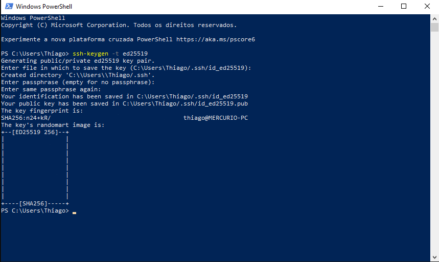 </p>
<p align="right"><i>(Imagem: Representação das chaves criadas no PowerShell / Windows)</i>

<br></br>

### Conferindo os arquivos gerados

Para verificar se as chaves foram criadas, execute o comando no PowerShell:

```bash
Get-ChildItem "$env:USERPROFILE\.ssh"
```

<p align="center"> 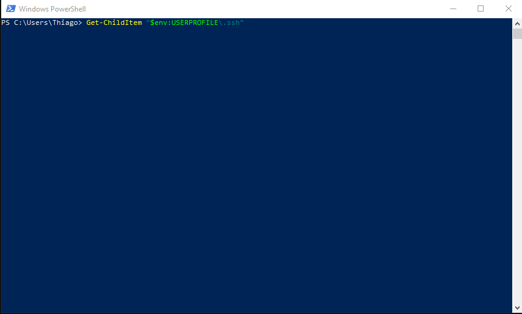 </p>
<p align="right"><i>(Imagem: Verificando as chaves criadas no PowerShell / Windows)</i>

<br></br>

O diretório deverá conter os arquivos `id_ed25519` e `id_ed25519.pub`, além de quaisquer outros arquivos SSH que já existam.

<p align="center"> 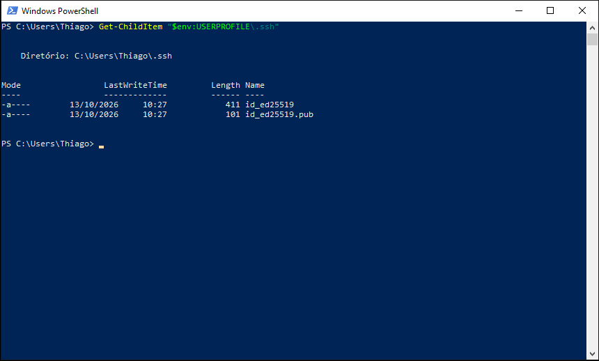 </p>
<p align="right"><i>(Imagem: Chaves criadas PowerShell / Windows)</i>

<br></br>

---

<br></br>

## 4. Instalando a chave no Ubuntu Server com PowerShell (Windows)

Em ambientes Windows, não é possível utilizar o comando `ssh-copy-id` no PowerShell para realizar a cópia da chave.

Por este motivo, utilizaremos o seguinte comando:

```bash
Get-Content "$env:USERPROFILE\.ssh\id_ed25519.pub" | ssh usuario@ip_do_servidor "mkdir -p ~/.ssh && cat >> ~/.ssh/authorized_keys && chmod 700 ~/.ssh && chmod 600 ~/.ssh/authorized_keys"
```
<p align="center"> 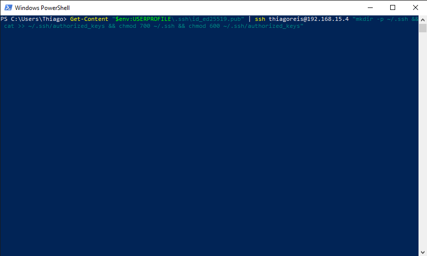 </p>
<p align="right"><i>(Imagem: Copiando a chave no PowerShell / Windows)</i>

<br></br>

Após pressionar <kbd>Enter</kbd> , o PowerShell vai perguntar se deseja continuar...

<p align="center">  </p>
<p align="right"><i>(Imagem: Copiando a chave no PowerShell / Windows)</i>

<br></br>

Digite `yes` e pressione <kbd>Enter</kbd>

<p align="center"> 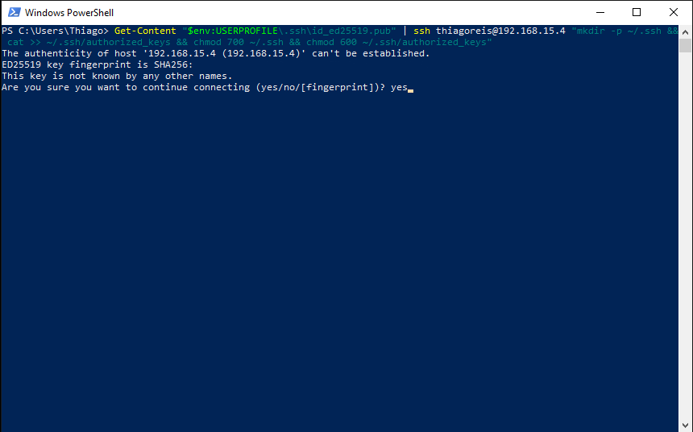 </p>
<p align="right"><i>(Imagem: Copiando a chave no PowerShell / Windows)</i>

<br></br>

Em seguida digite a senha do usuário cadastrado na máquina virtual (VM).

<p align="center"> 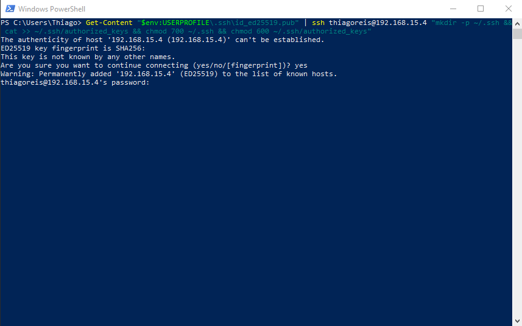 </p>
<p align="right"><i>(Imagem: Copiando a chave no PowerShell / Windows)</i>

<br></br>

Pronto, a chave foi copiada para a máquina virtual.

<p align="center"> 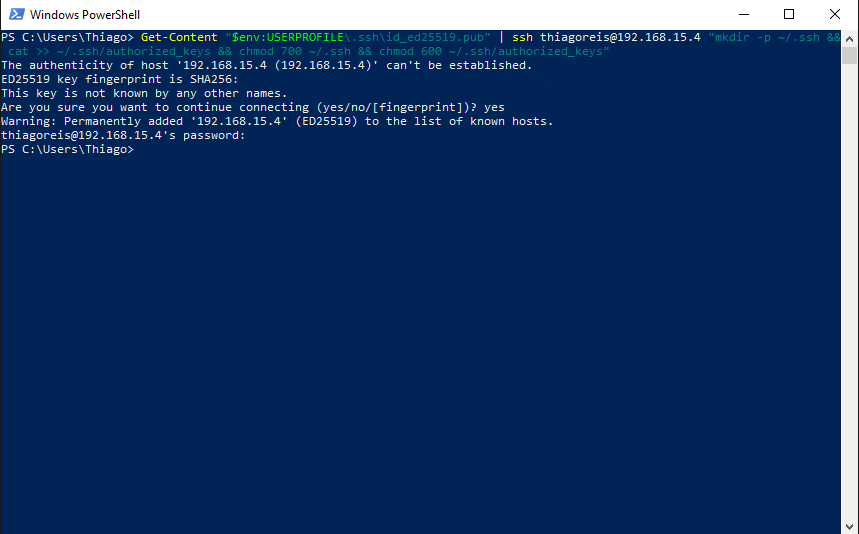 </p>
<p align="right"><i>(Imagem: Copiando a chave no PowerShell / Windows)</i>

<br></br>

### Testando a conexão via PowerShell no Windows

Nesta etapa, vamos testar a conexão SSH utilizando o PowerShell do Windows para acessar a máquina virtual Ubuntu Server.

No PowerShell digite o comando abaixo e pressione <kbd>Enter</kbd>.

```bash
ssh seu_usuario@ip_do_servidor
```

<p align="center"> 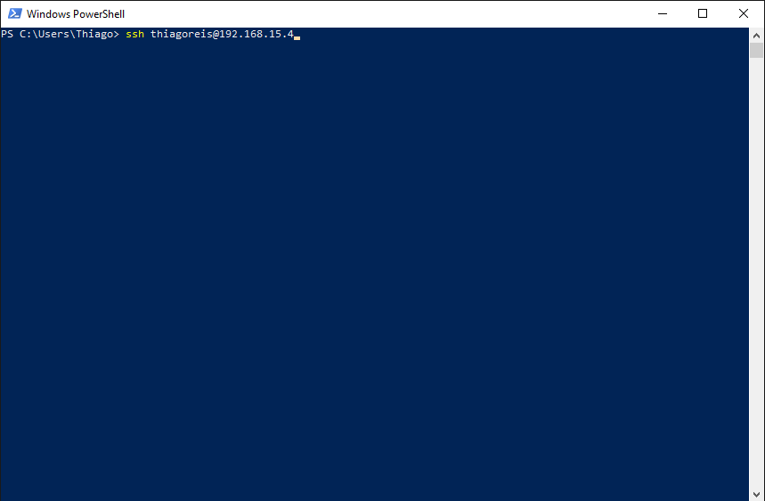 </p>
<p align="right"><i>(Imagem: Conectando via SSH no PowerShell / Windows)</i>

<br></br>

A imagem abaixo é uma representação da conexão estabelecida com sucesso a máquina virtual.

<p align="center"> 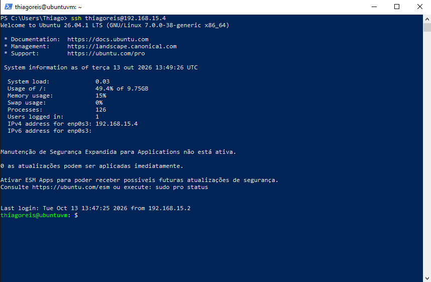 </p>
<p align="right"><i>(Imagem: Conectando via SSH no PowerShell / Windows)</i>

---

<br></br>

### Configurando o ~/.ssh/config com PowerShell no Windows

O arquivo `config`, localizado na pasta `.ssh` do usuário, permite definir configurações e aliases para conexões SSH.

No Windows, o caminho padrão é:

```bash
C:\Users\SEU_USUARIO_DO_WIN\.ssh\config
```

Agora, vamos editar o arquivo `config`, utilizando o PowerShell.

Digite no PowerShell o seguinte comando:

```bash
notepad "$env:USERPROFILE\.ssh\config"
```

<p align="center"> 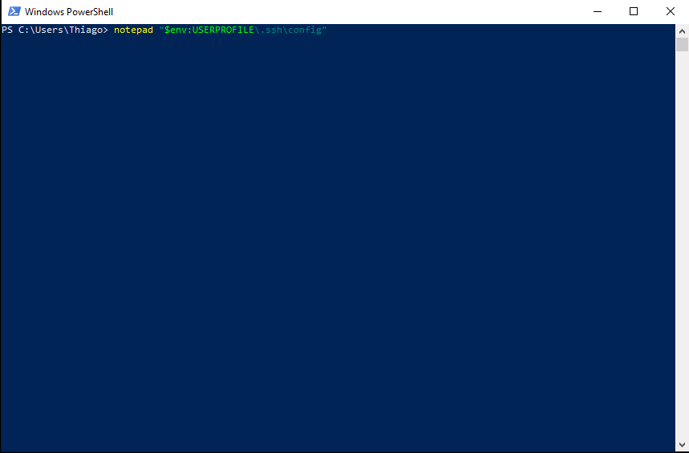 </p>
<p align="right"><i>(Imagem: Abrindo o bloco de notas via PowerShell / Windows)</i>

<br></br>

Após digitar o comando e pressionar a tecla <kbd>Enter</kbd>, o Windows pode exibir uma tela de confirmação para criar um novo arquivo, caso o `config` não exista no sistema. Clique em <kbd>"Sim"</kbd> para criar o novo arquivo.

<p align="center"> 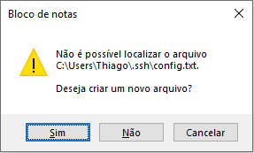 </p>
<p align="right"><i>(Imagem: Tela de confirmação para criar um novo arquivo config / Windows)</i>

<br></br>

Exemplo de configuração para a máquina virtual Ubuntu:

```bash
    Host ubuntu-lab
        HostName 192.168.15.4
        User SEU_USUARIO_DA_VM
        IdentityFile C:\Users\SEU_USUARIO_DO_WIN\.ssh\id_ed25519
```

<p align="center"> 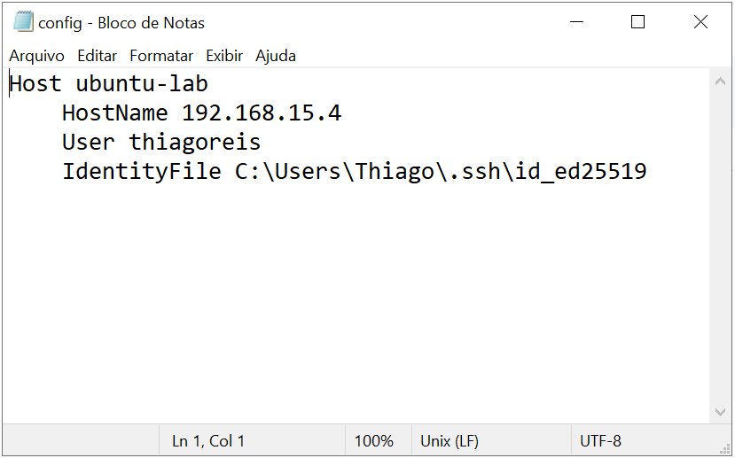 </p>
<p align="right"><i>(Imagem: Exemplo do arquivo config / Windows)</i>

<br></br>

Substitua `192.168.15.4` pelo endereço IP real da máquina virtual e na opção `SEU_USUARIO_DA_VM` pelo usuário existente no Ubuntu Server.

Com essa configuração, a conexão poderá ser iniciada utilizando o alias:

```bash
    ssh ubuntu-lab
```

<p align="center"> 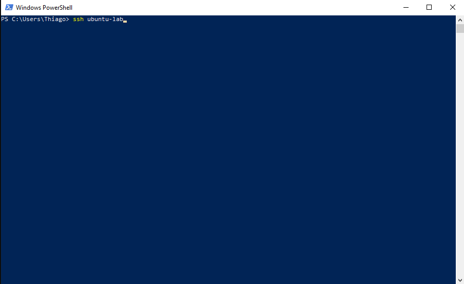 </p>
<p align="right"><i>(Imagem: Acessando o Ubuntu via PowerShell / Windows)</i>

<br></br>

Agora temos o acesso a máquina virtual Ubuntu Server com o alias e chave.

<p align="center"> 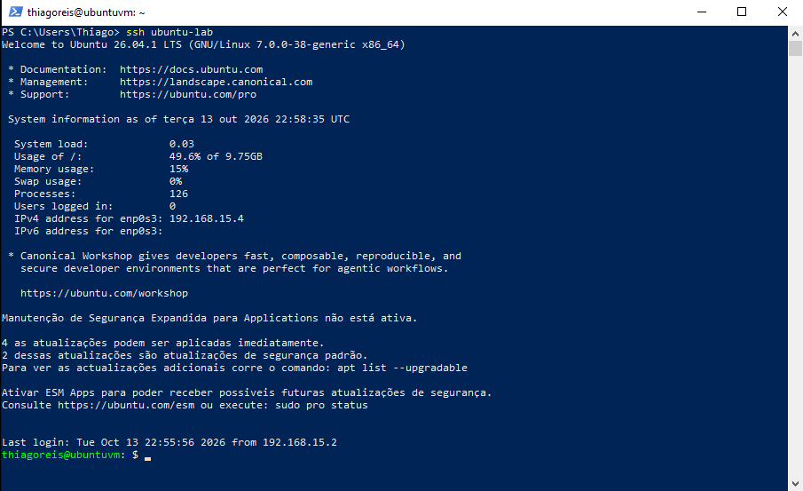 </p>
<p align="right"><i>(Imagem: Acessando o Ubuntu via PowerShell / Windows)</i>

---

<br></br>

### Possíveis problemas no arquivo config com PowerShell

Durante a configuração do SSH, se houver erros na conexão, remova o arquivo `config` com o comando:

```bash
Remove-Item "$env:USERPROFILE\.ssh\config*" -force
```

<p align="center"> 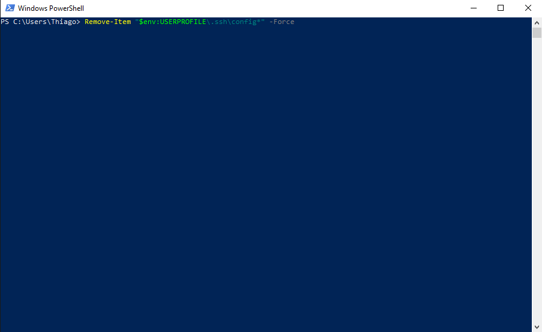 </p>
<p align="right"><i>(Imagem: Acessando o Ubuntu via PowerShell / Windows)</i>

<br></br>

```bash
@'
Host ubuntu-lab
    HostName 192.168.15.4
    User SEU_USUARIO_VM
    IdentityFile C:\Users\SEU_USUARIO_WIN\.ssh\id_ed25519
'@ | Out-File -FilePath "$env:USERPROFILE\.ssh\config" -Encoding ascii -Force
```

<p align="center"> 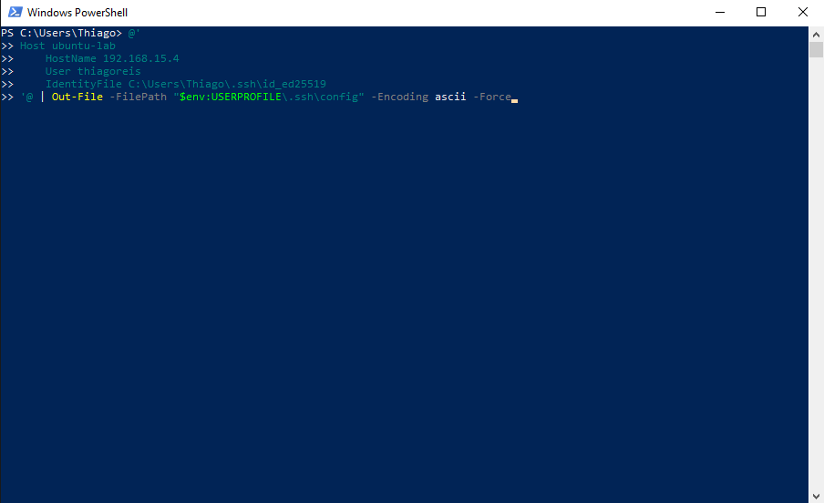 </p>
<p align="right"><i>(Imagem: Acessando o Ubuntu via PowerShell / Windows)</i>

<br></br>

Para confirmar que os arquivos foram criados, execute o comando abaixo:

```bash
Get-ChildItem "$env:USERPROFILE\.ssh"
```

<p align="center"> 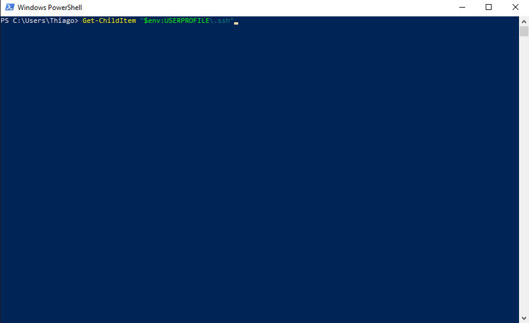 </p>
<p align="right"><i>(Imagem: Acessando o Ubuntu via PowerShell / Windows)</i>

<br></br>

O PowerShell deve exibir as chaves...

<p align="center"> 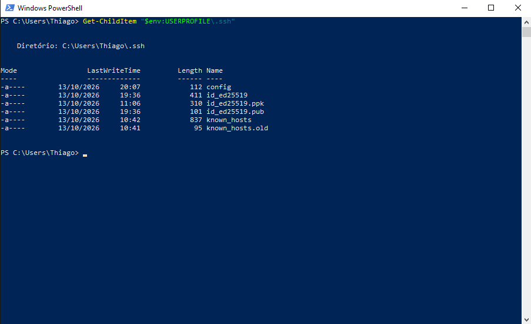 </p>
<p align="right"><i>(Imagem: Acessando o Ubuntu via PowerShell / Windows)</i>

<br></br>

Agora vamos enviar a chave para a máquina virtual Ubuntu Server, para isso utilize o comando:

```bash
Get-Content $env:USERPROFILE\.ssh\id_ed25519.pub | ssh ubuntu-lab "mkdir -p ~/.ssh && cat >> ~/.ssh/authorized_keys && chmod 700 ~/.ssh && chmod 600 ~/.ssh/authorized_keys"
```

<p align="center"> 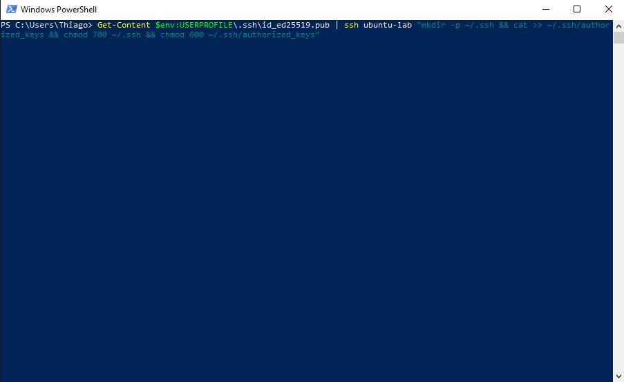 </p>
<p align="right"><i>(Imagem: Acessando o Ubuntu via PowerShell / Windows)</i>

---

<br></br>

### Converter Chaves OpenSSH para o Formato PuTTY (.ppk) no Windows

Por padrão, chaves criadas via terminal através do comando `ssh-keygen` no PowerShell, Linux ou macOS, utilizam o formato OpenSSH. No entanto, o cliente PuTTY exige chaves no formato proprietário `.ppk`. Neste tópico vamos documentar como realiza a conversão.

Para converter a chave, abra o PuTTYgen digitando no campo de Pesquisar do sistema operacional Windows, conforme a imagem abaixo.

<p align="center"> 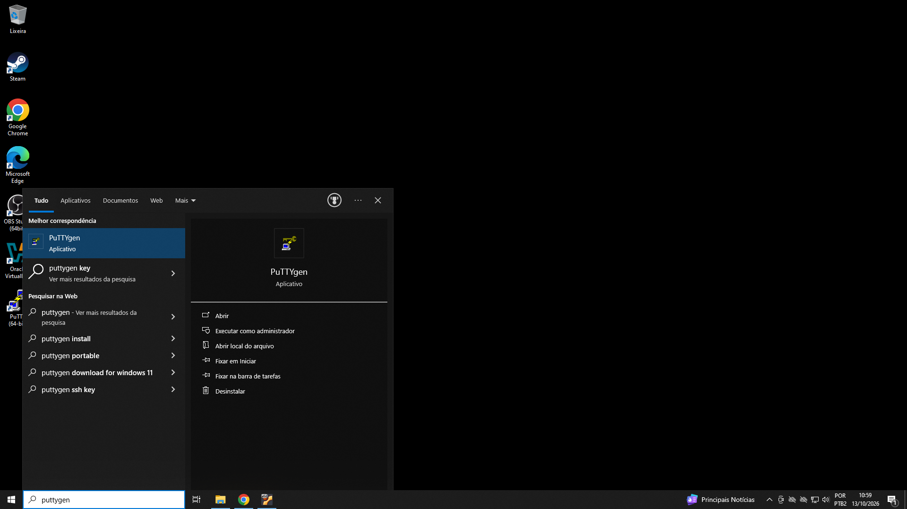 </p>
<p align="right"><i>(Imagem: Convertendo chave com o PuTTYgen / Windows)</i>

<br></br>

Com o PuTTYgen aberto, clique na opção <kbd>File</kbd> que está localizada no menu superior.

<p align="center"> 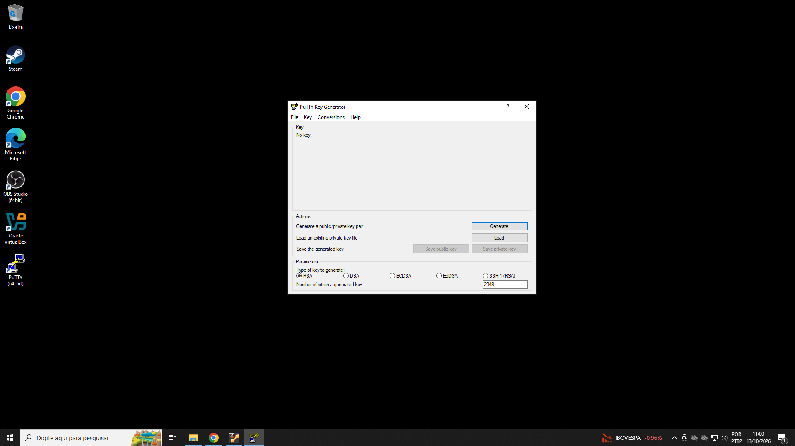 </p>
<p align="right"><i>(Imagem: Convertendo chave com o PuTTYgen / Windows)</i>

<br></br>

Em seguida, clique em <kbd>"Load private key"</kbd>

<p align="center"> 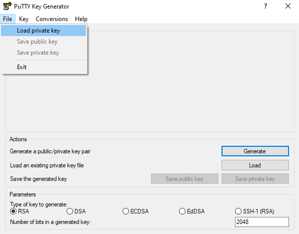 </p>
<p align="right"><i>(Imagem: Convertendo chave com o PuTTYgen / Windows)</i>

<br></br>

Na caixa de seleção, altere o tipo de arquivo selecionando a opção <kbd>"All Files"</kbd>

<p align="center"> 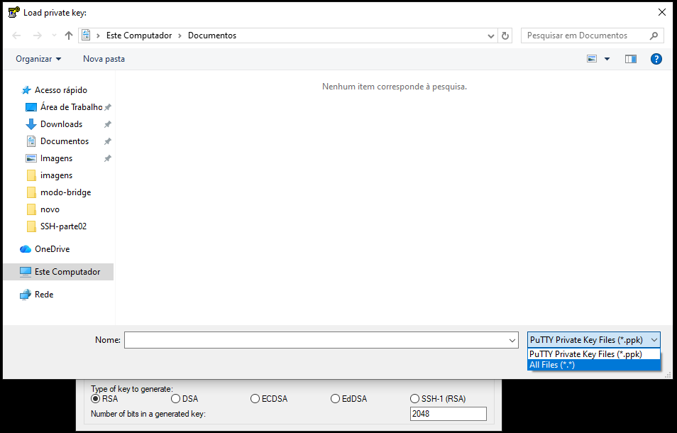 </p>
<p align="right"><i>(Imagem: Convertendo chave com o PuTTYgen / Windows)</i>

<br></br>

Acesse o `C:\` e depois a pasta `Usuários`

<p align="center"> 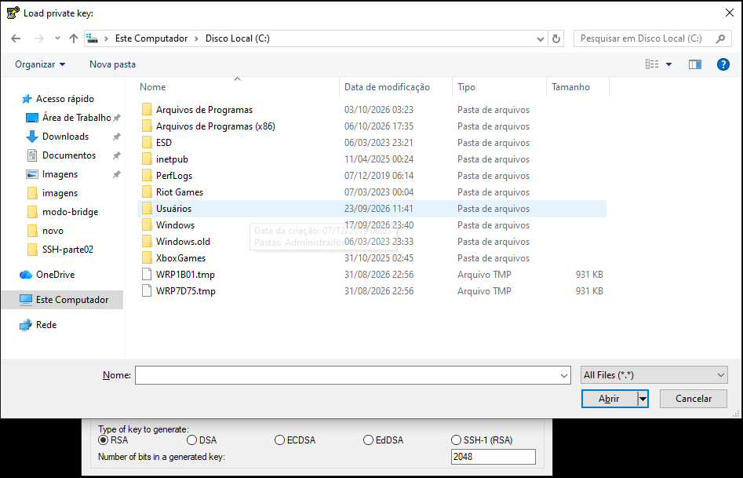 </p>
<p align="right"><i>(Imagem: Convertendo chave com o PuTTYgen / Windows)</i>

<br></br>

Acesse a pasta `.ssh`

<p align="center"> 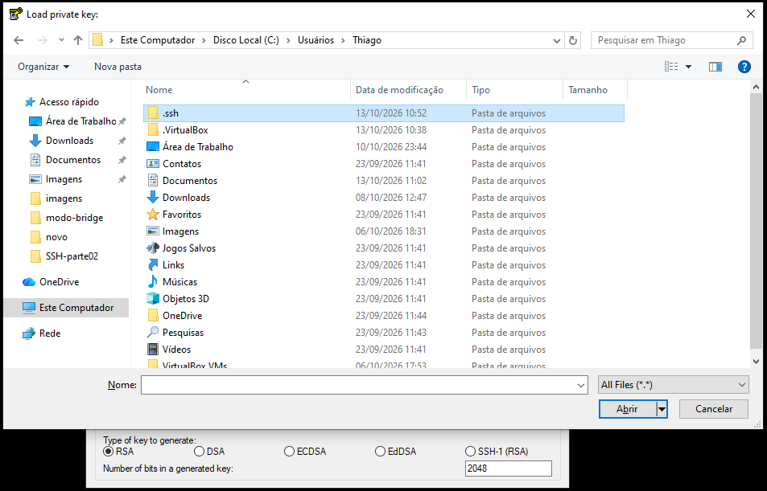 </p>
<p align="right"><i>(Imagem: Convertendo chave com o PuTTYgen / Windows)</i>

<br></br>

Localize a sua chave privada, selecione-a e clique em <kbd>"Abrir"</kbd>. Se você colocou uma senha (passphrase) na chave, o PuTTYgen vai solicitar para você digitá-la.

<p align="center"> 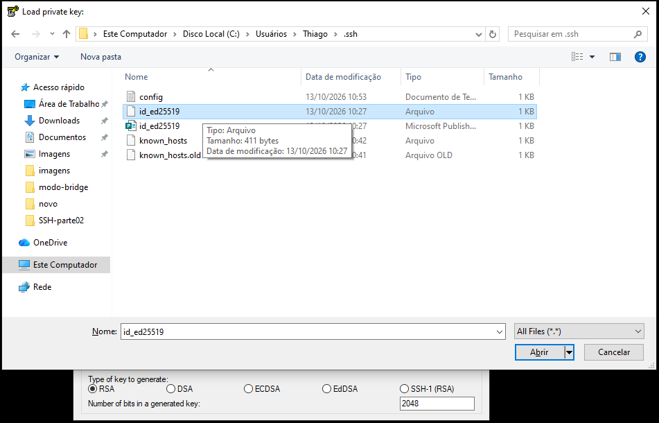 </p>
<p align="right"><i>(Imagem: Convertendo chave com o PuTTYgen / Windows)</i>

<br></br>

Se tudo estiver correto, o PuTTYgen vai exibir uma tela confirmando a importação da chave.

<p align="center"> 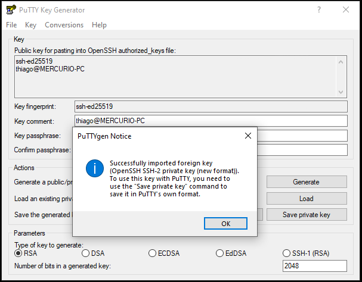 </p>
<p align="right"><i>(Imagem: Convertendo chave com o PuTTYgen / Windows)</i>

<br></br>

Agora, clique no botão <kbd>"Save private key"</kbd> e salve o arquivo com o nome `id_ed25519.ppk` dentro da mesma pasta.

<p align="center"> 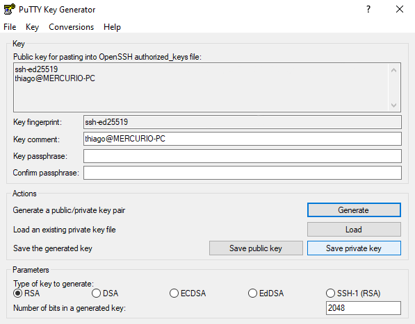 </p>
<p align="right"><i>(Imagem: Convertendo chave com o PuTTYgen / Windows)</i>

<br></br>

Quando a chave não tem uma senha (passphrase), o PuTTYgen exige a confirmação se deseja continuar e salvar a chave sem uma senha para protegê-la.

OBS: Recomendação, criar uma `passphrase` para as chaves em ambiente de produção. Nunca envie para o repositório do GitHub chaves privadas!

<p align="center"> 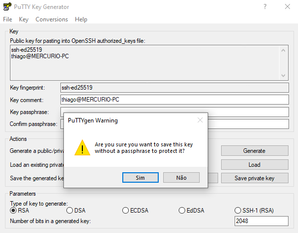 </p>
<p align="right"><i>(Imagem: Convertendo chave com o PuTTYgen / Windows)</i>

<br></br>

Matenha o local padrão para salvar o arquivo e clique em <kbd>"Salvar"</kbd>.

<p align="center"> 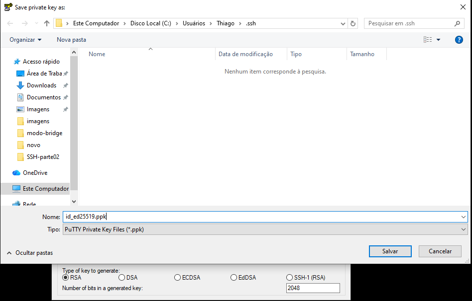 </p>
<p align="right"><i>(Imagem: Convertendo chave com o PuTTYgen / Windows)</i>

<br></br>

Depois de salvar a chave, abra o PuTTY.

<p align="center"> 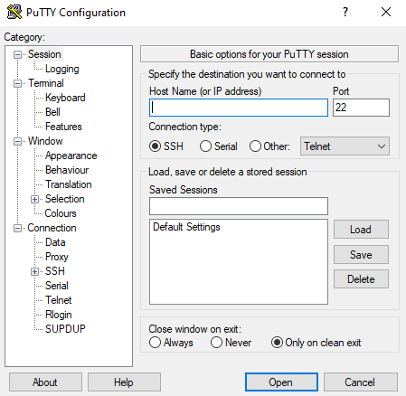 </p>
<p align="right"><i>(Imagem: Convertendo chave com o PuTTYgen / Windows)</i>

<br></br>

No menu lateral a esquerda do PuTTY, vá em Connection -> SSH -> Credentials / Auth, clique em Browse... e selecione esse novo arquivo `.ppk` gerado pelo PuTTYgen.

<p align="center"> 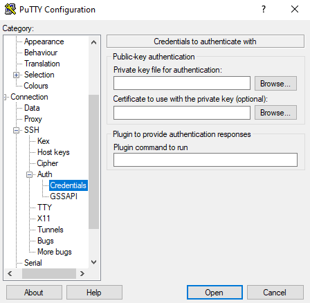 </p>
<p align="right"><i>(Imagem: Convertendo chave com o PuTTYgen / Windows)</i>

<br></br>

Acesse a pasta `C:\Usuários\SEU_USUARIO_WIN\.ssh\`

<p align="center"> 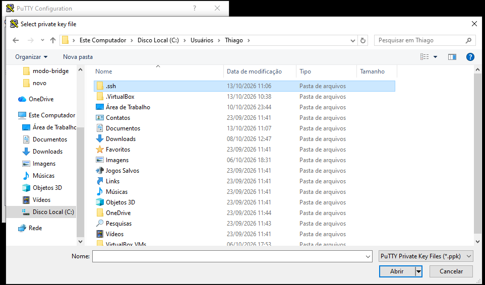 </p>
<p align="right"><i>(Imagem: Convertendo chave com o PuTTYgen / Windows)</i>

<br></br>

E selecione a chave convertida através do PuTTYgen.

<p align="center"> 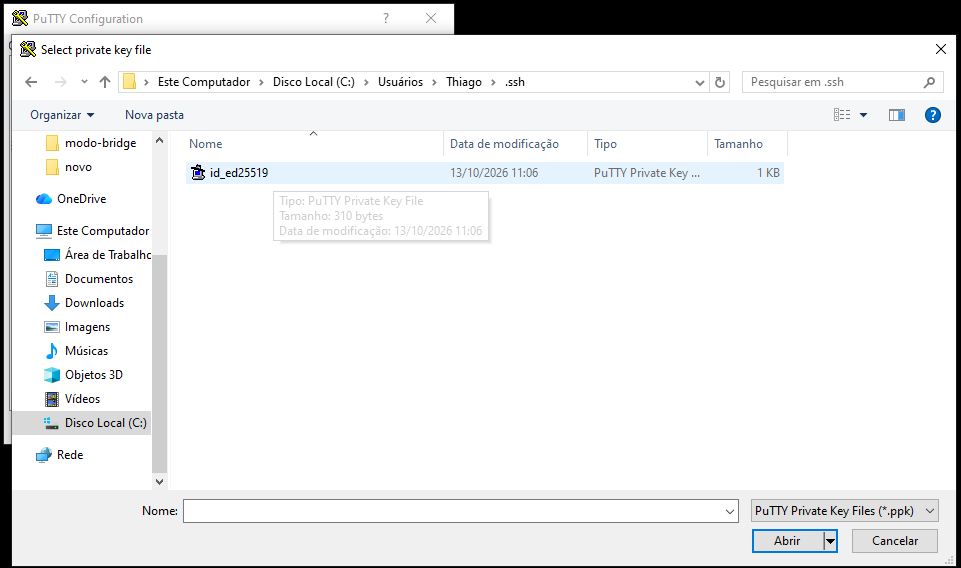 </p>
<p align="right"><i>(Imagem: Convertendo chave com o PuTTYgen / Windows)</i>

<br></br>

A tela de configuração das credenciais deve ficar semelhante a imagem:

<p align="center"> 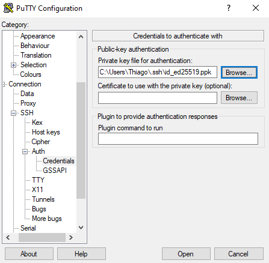 </p>
<p align="right"><i>(Imagem: Convertendo chave com o PuTTYgen / Windows)</i>

<br></br>

No menu lateral do PuTTY, clique em <kbd>"Session"</kbd> 

<p align="center"> 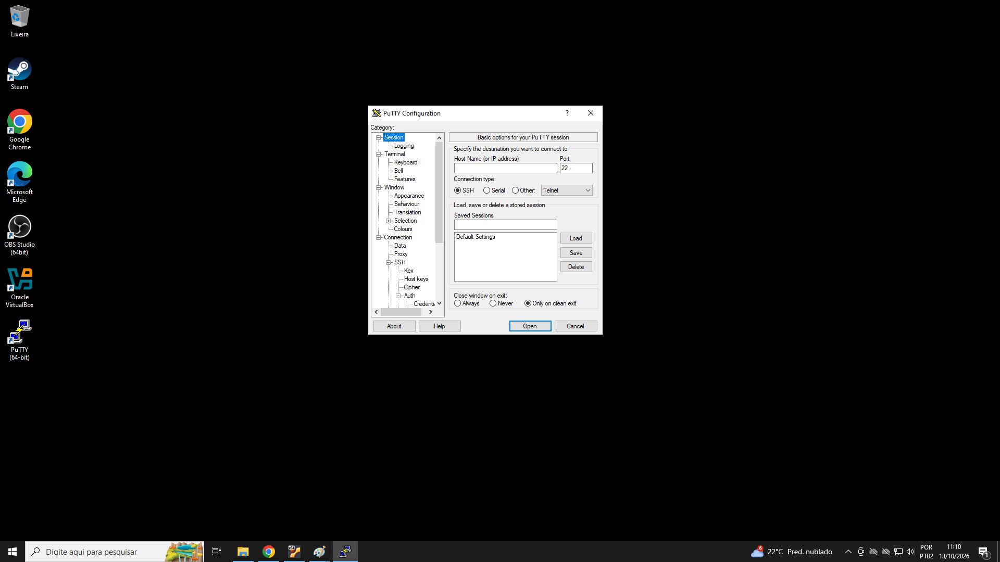 </p>
<p align="right"><i>(Imagem: Convertendo chave com o PuTTYgen / Windows)</i>

<br></br>

No campo Host, utilize o usuário e IP da máquina virtual (VM).

Por exemplo:

```bash
seu_usuario_vm@IP_da_VM
```

Substitua as informações de `usuário` e `IP` de acordo com seu o ambiente e clique em <kbd>"Open"</kbd>.

<p align="center"> 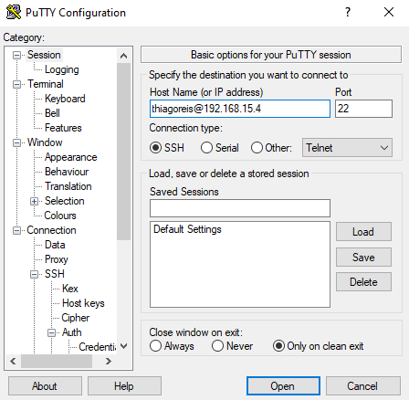 </p>
<p align="right"><i>(Imagem: Convertendo chave com o PuTTYgen / Windows)</i>

<br></br>

O PuTTY vai conectar a máquina virtual sem a necessidade de senha.

<p align="center"> 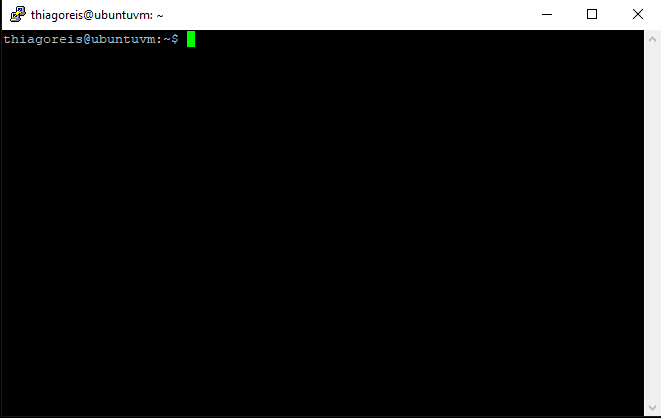 </p>
<p align="right"><i>(Imagem: Convertendo chave com o PuTTYgen / Windows)</i>

<br></br>

## 5. WSL/Ubuntu no Windows

WSL (Windows Subsystem for Linux) permite executar um ambiente Linux diretamente no Windows, sem a necessidade de instalar uma máquina virtual ou configurar um dual-boot.

Vamos ver agora como instalar o WSL/Ubuntu no Windows, para isso abra o PowerShell.

<p align="center"> 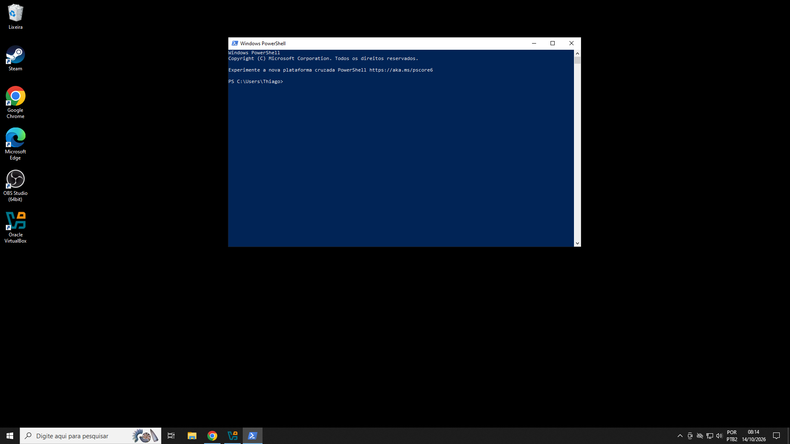 </p>
<p align="right"><i>(Imagem: Instalando WSL/Ubuntu no Windows)</i>

<br></br>

Para iniciar o processo de instalação do WSL, digite o comando:

```bash
wsl --install
```


<p align="center"> 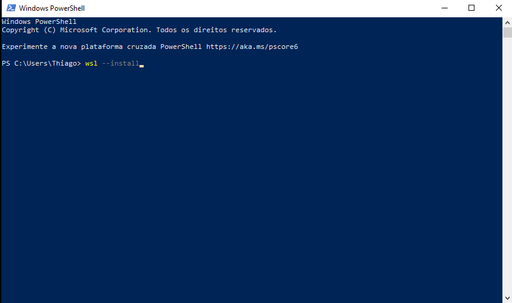 </p>
<p align="right"><i>(Imagem: Instalando WSL/Ubuntu no Windows)</i>

<br></br>

Atenção, durante a etapa de instalação do WSL, o sistema operacional Windows vai abrir o controle de conta, solicitando a permissão para continuar. Clique em <kbd>"Sim"</kbd>.

Após a confirmação, o PowerShell vai iniciar a instalação do WSL.

<p align="center"> 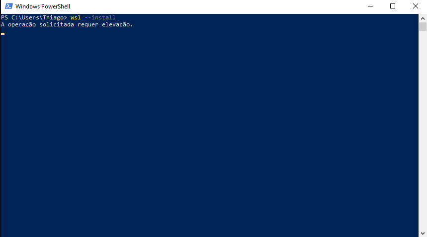 </p>
<p align="right"><i>(Imagem: Instalando WSL/Ubuntu no Windows)</i>

<br></br>

Aguarde o processo de instalação. Durante essa fase o Windows pode solicitar a confirmação para continuar.

<p align="center"> 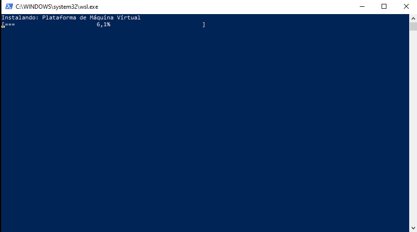 </p>
<p align="right"><i>(Imagem: Instalando WSL/Ubuntu no Windows)</i>

<br></br>

Nesta etapa, durante a instalação do WSL, o sistema operacional Windows vai abrir o controle de conta, solicitando a permissão para continuar. Clique em <kbd>"Sim"</kbd>.

<br></br>

O sistema vai continuar com a instalação.

<p align="center"> 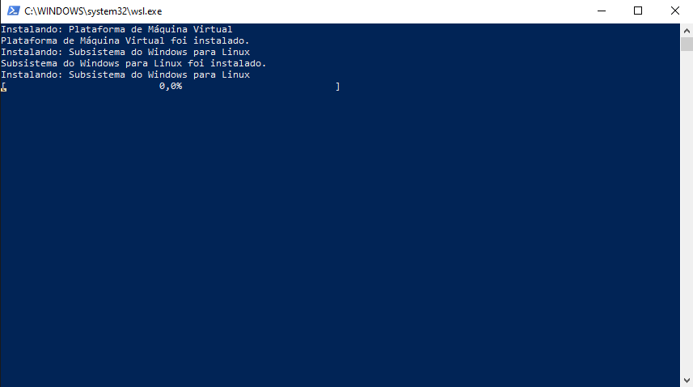 </p>
<p align="right"><i>(Imagem: Instalando WSL/Ubuntu no Windows)</i>

<br></br>

Aguarde este processo enquanto o Windows instala o WSL...

<p align="center"> 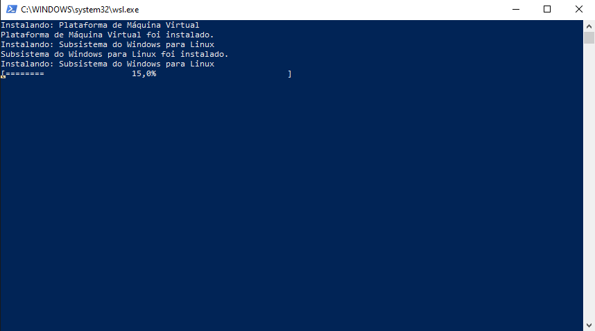 </p>
<p align="right"><i>(Imagem: Instalando WSL/Ubuntu no Windows)</i>

<br></br>

Abaixo a imagem é uma representação da instalação do WSL/Ubuntu no Windows.

<p align="center"> 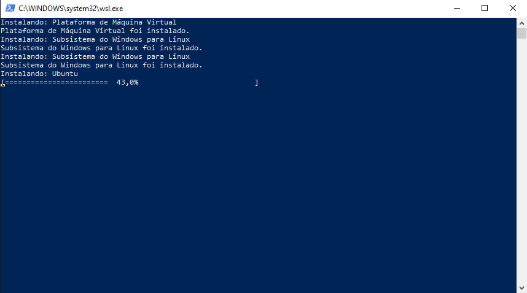 </p>
<p align="right"><i>(Imagem: Instalando WSL/Ubuntu no Windows)</i>

<br></br>

Após terminar o processo de instalação, o PowerShell informa para **reiniciar** o sistema operacional e concluir as alterações.

<p align="center"> 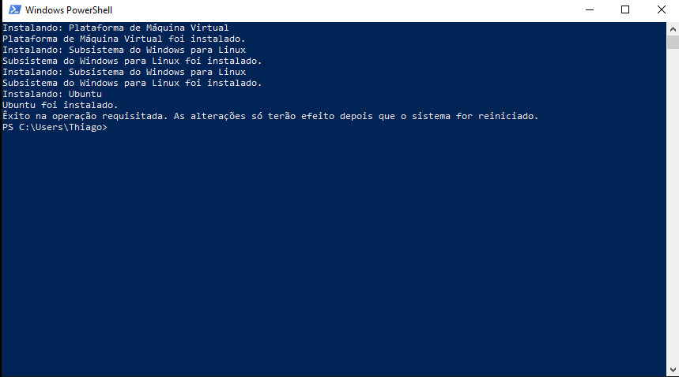 </p>
<p align="right"><i>(Imagem: Instalando WSL/Ubuntu no Windows)</i>

<br></br>

Clique no icone principal do Windows no canto inferior esquerdo do menu iniciar e reinicie o sistema.

<p align="center"> 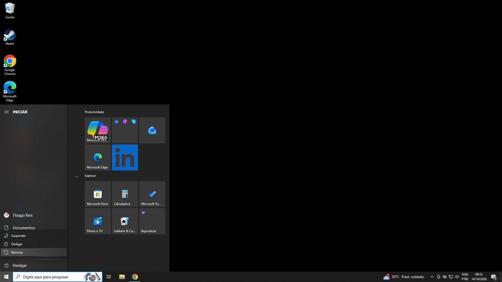 </p>
<p align="right"><i>(Imagem: Instalando WSL/Ubuntu no Windows)</i>

<br></br>

Após reiniciar o sistema o processo de instalação do WSL é aberto e continua...

<p align="center"> 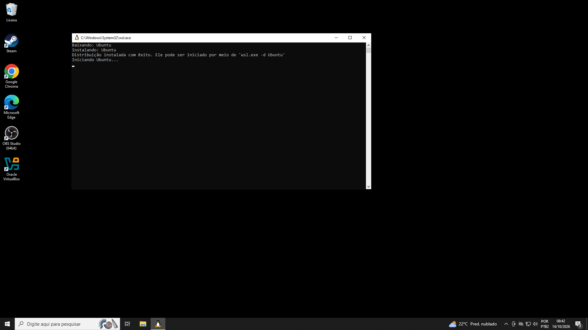 </p>
<p align="right"><i>(Imagem: Instalando WSL/Ubuntu no Windows)</i>

<br></br>

Quando o processo de instalação finalizar, o Windows vai exibir a tela de boas vindas ao WSL.

<p align="center">  </p>
<p align="right"><i>(Imagem: Instalando WSL/Ubuntu no Windows)</i>

<br></br>

Neste momento, podemos fechar a tela de boas vindas do WSL.

<p align="center"> 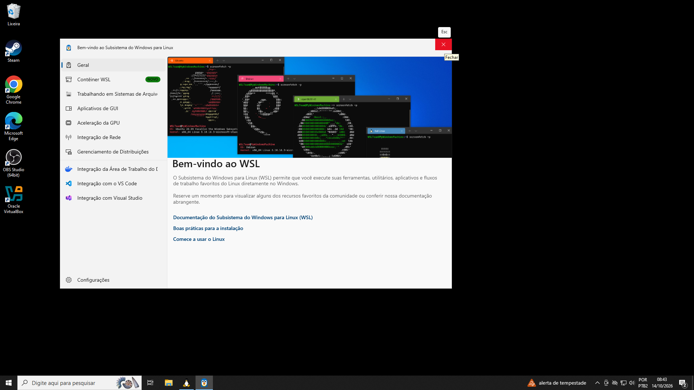 </p>
<p align="right"><i>(Imagem: Instalando WSL/Ubuntu no Windows)</i>

<br></br>

Defina um nome de usuário para o WSL.

<p align="center"> 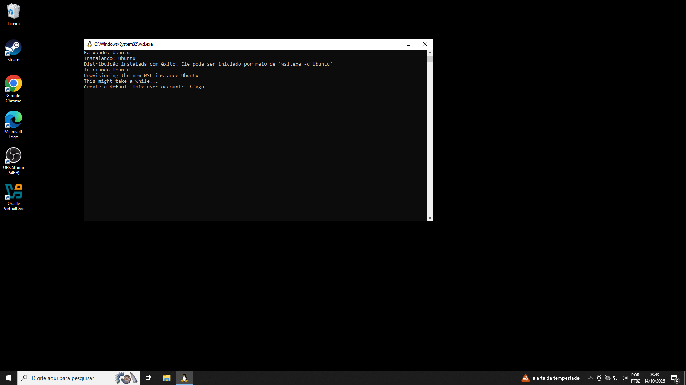 </p>
<p align="right"><i>(Imagem: Instalando WSL/Ubuntu no Windows)</i>

<br></br>

Digite a senha para o usuário do WSL.

<p align="center"> 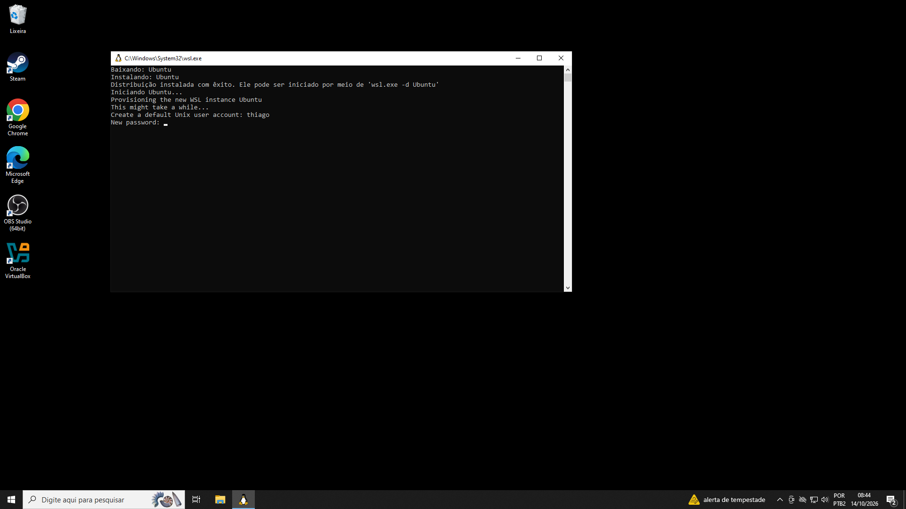 </p>
<p align="right"><i>(Imagem: Instalando WSL/Ubuntu no Windows)</i>

<br></br>

Confirme a senha cadastrada do usuário do WSL.

<p align="center">  </p>
<p align="right"><i>(Imagem: Instalando WSL/Ubuntu no Windows)</i>

<br></br>

A próxima tela após a criação do usuário no WSL é a respeito de coleta e envio de informações anônimas do sistema operacional aos densenvolvedores.

Neste laboratório, a opção foi definida com "Não"

```bash
y = sim
n = não
```

<p align="center">  </p>
<p align="right"><i>(Imagem: Instalando WSL/Ubuntu no Windows)</i>

<br></br>

Digite a opção desejada e pressione <kbd>Enter</kbd>. Neste exemplo:

```bash
n
```

<p align="center"> 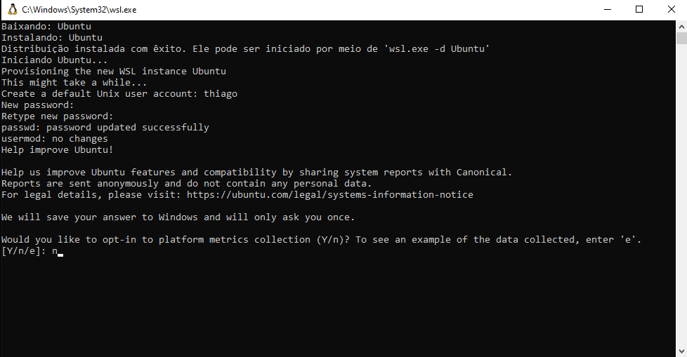 </p>
<p align="right"><i>(Imagem: Instalando WSL/Ubuntu no Windows)</i>

<br></br>

Pronto! O WSL foi instalado com sucesso...

<p align="center"> 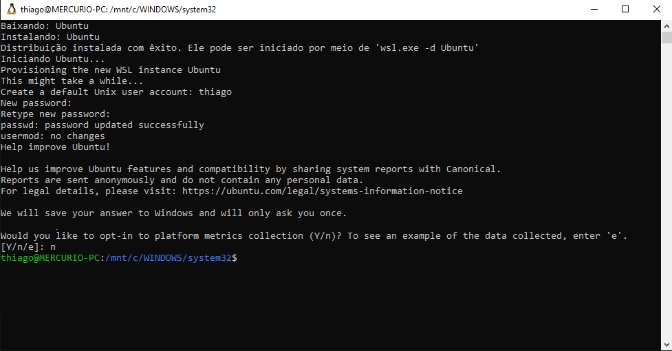 </p>
<p align="right"><i>(Imagem: Instalando WSL/Ubuntu no Windows)</i>

<br></br>

### Abrir e testar o WSL

Para utilizar o WSL, abra o PowerShell.

<p align="center"> 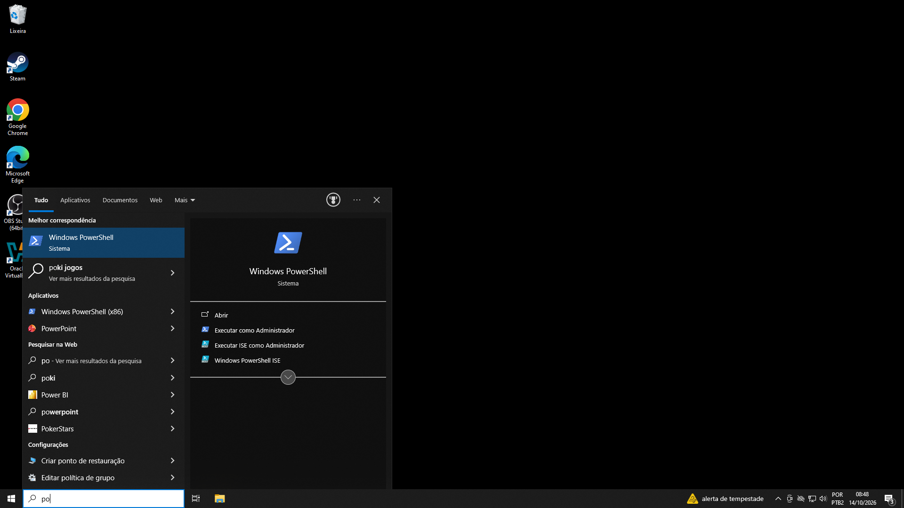 </p>
<p align="right"><i>(Imagem: Instalando WSL/Ubuntu no Windows)</i>

<br></br>

No PowerShell digite o comando:

```bash
wsl
```

Após digitar o comando, pressione <kbd>Enter</kbd>; o WSL será carregado dentro do PowerShell.

<p align="center"> 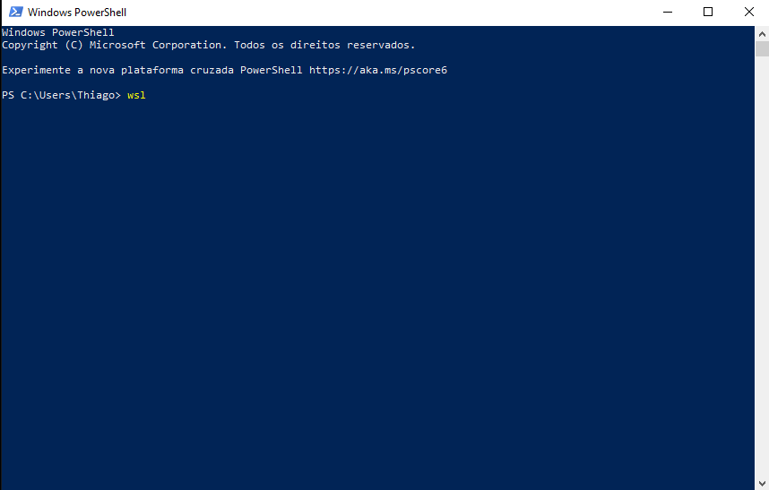 </p>
<p align="right"><i>(Imagem: Instalando WSL/Ubuntu no Windows)</i>

<br></br>

Com isso o Windows vai carregar um sistema Linux virtualizado usando como recurso o WSL.

<p align="center"> 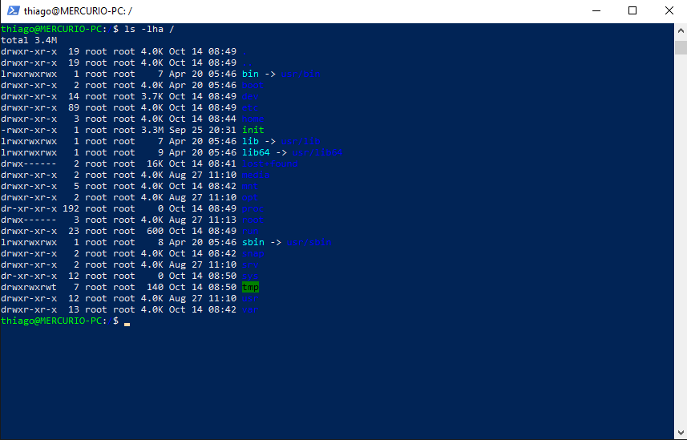 </p>
<p align="right"><i>(Imagem: Instalando WSL/Ubuntu no Windows)</i>

<br></br>

---

### Instalando a chave no WSL/Ubuntu (Windows)

#### Criando as chaves no WSL/Ubuntu

Esta etapa demonstra como criar as chaves no WSL (Windows), primeiro abra o PowerShell.

<p align="center">  </p>
<p align="right"><i>(Imagem: WSL/Ubuntu via PowerShell)</i>

<br></br>

No PowerShell digite wsl e pressione Enter.

<p align="center"> 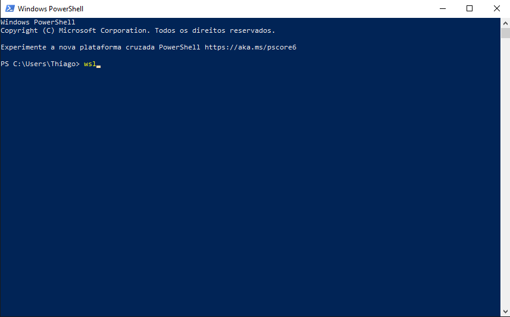 </p>
<p align="right"><i>(Imagem: WSL/Ubuntu via PowerShell)</i>

<br></br>

Perceba que o terminal indica que agora está utilizando o WSL.

<p align="center"> 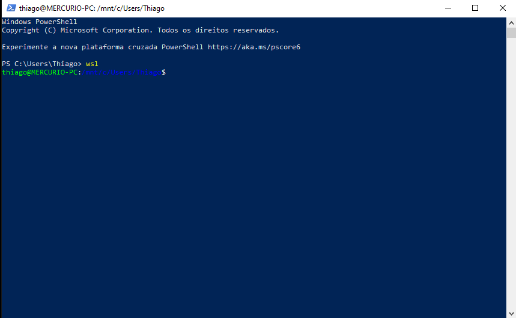 </p>
<p align="right"><i>(Imagem: WSL/Ubuntu via PowerShell)</i>

<br></br>

O processo para criar as chaves no WSL/Ubuntu é semelhante a etapa do PowerShell.

No terminal digire o comando:

<p align="center"> 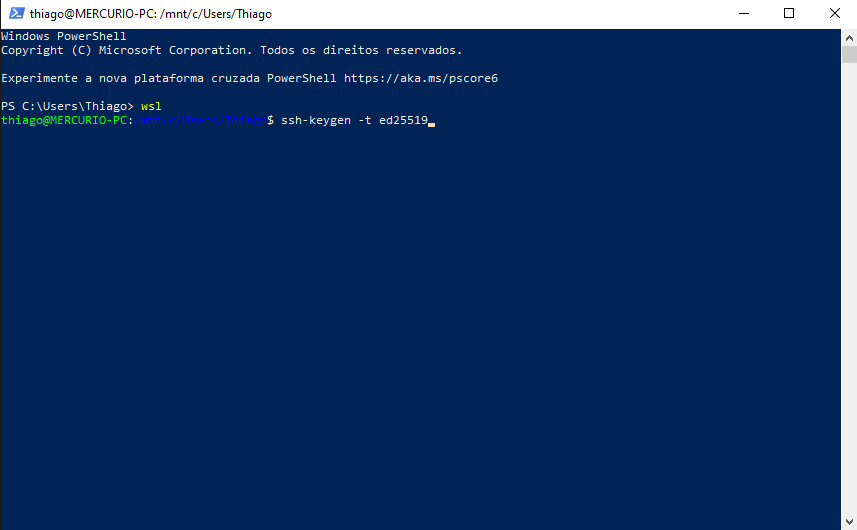 </p>
<p align="right"><i>(Imagem: WSL/Ubuntu via PowerShell)</i>

<br></br>

O terminal questina se deseja salvar as chaves no diretório padrão, pressione <kbd>Enter</kbd> para avançar sem alterar o caminho.

<p align="center"> 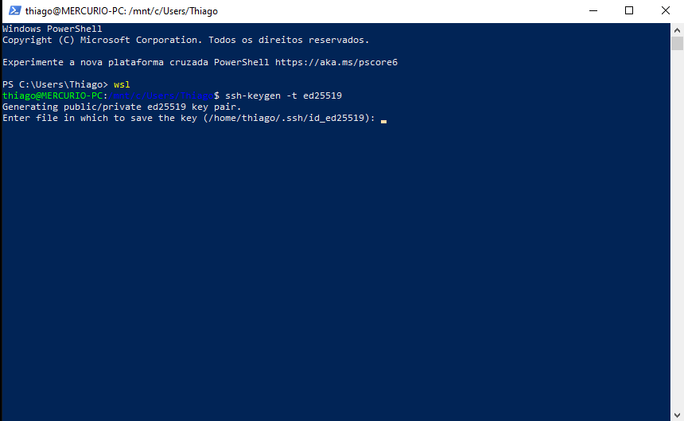 </p>
<p align="right"><i>(Imagem: WSL/Ubuntu via PowerShell)</i>

<br></br>

Neste momento o terminal informa se desenha criar uma senha (Passphrase) para acesso a chave. Defina a senha ou deixe em branco e pressione Enter.

<p align="center"> 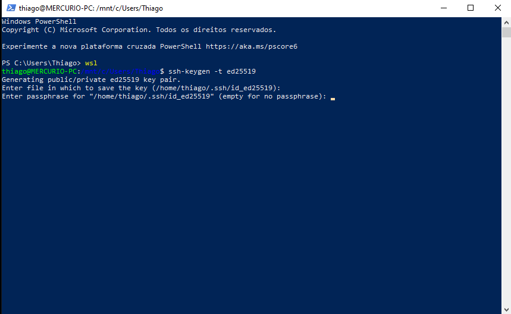 </p>
<p align="right"><i>(Imagem: WSL/Ubuntu via PowerShell)</i>

<br></br>

Confirme a Passphrase e pressione <kbd>Enter</kbd>.

<p align="center"> 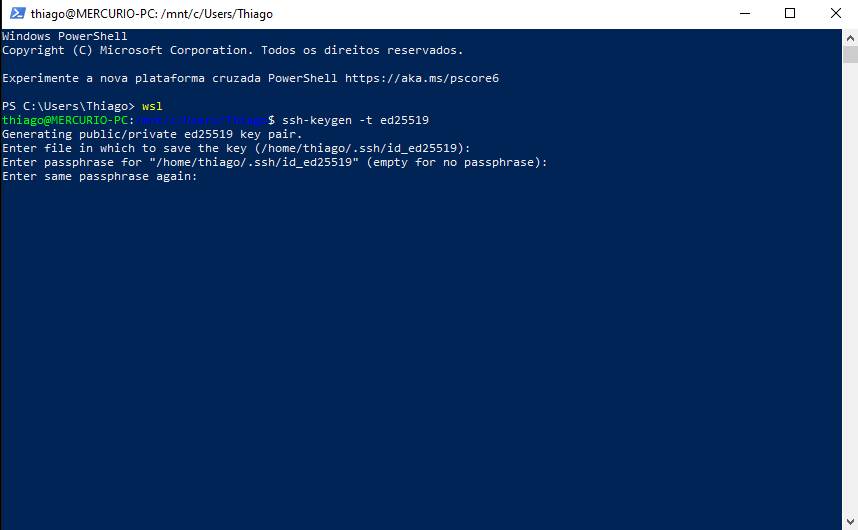 </p>
<p align="right"><i>(Imagem: WSL/Ubuntu via PowerShell)</i>

<br></br>

Com as chaves criadas, o terminal exibe as confirmações...

<p align="center"> 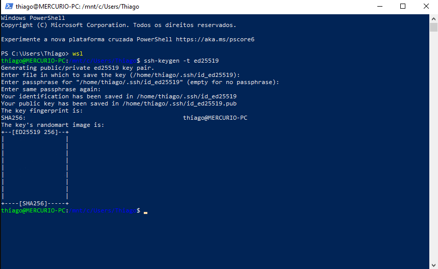 </p>
<p align="right"><i>(Imagem: WSL/Ubuntu via PowerShell)</i>

<br></br>

#### ssh-copy-id

O comando `ssh-copy-id` permite copiar a chave pública para um servidor remoto, facilitando a configuração da autenticação por chave SSH.

<p align="center"> 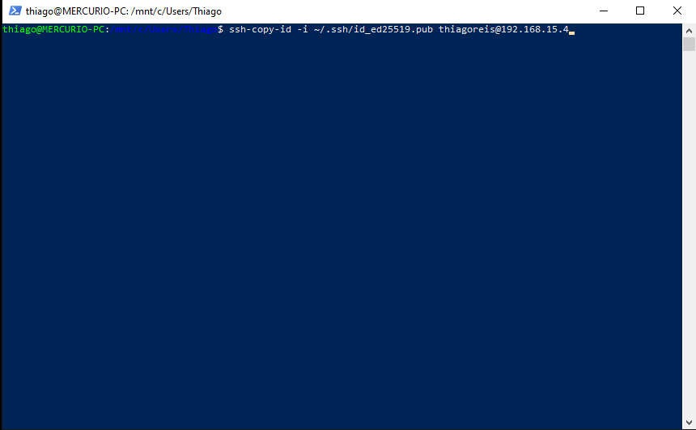 </p>
<p align="right"><i>(Imagem: WSL/Ubuntu via PowerShell)</i>

<br></br>

Digite a senha do usuário da máquina virtual (VM) para confirmar o acesso.

<p align="center"> 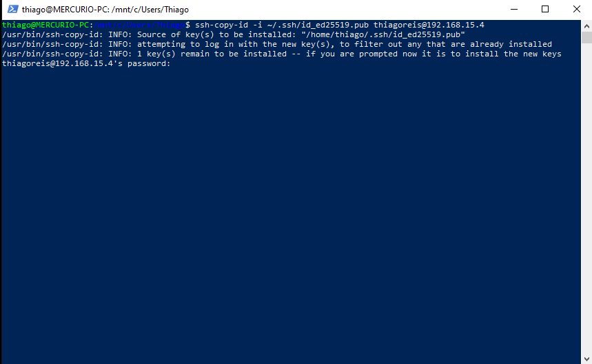 </p>
<p align="right"><i>(Imagem: WSL/Ubuntu via PowerShell)</i>

<br></br>

Pronto, após a cópia da chave o terminal exibe as informações.

<p align="center"> 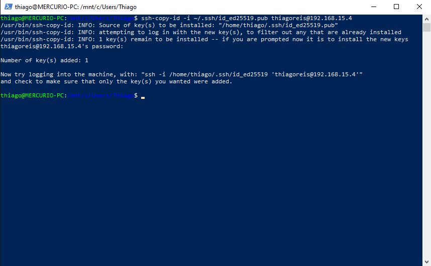 </p>
<p align="right"><i>(Imagem: WSL/Ubuntu via PowerShell)</i>

<br></br>

#### ~/.ssh/config

O arquivo config

<p align="center"> 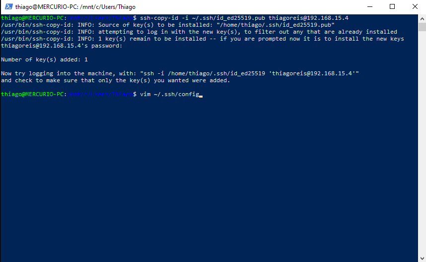 </p>
<p align="right"><i>(Imagem: WSL/Ubuntu via PowerShell)</i>

<br></br>

Vamos editar o arquivo config com o comando:

```bash
vim ~/.ssh/config
```

No arquivo insira:


<p align="center"> 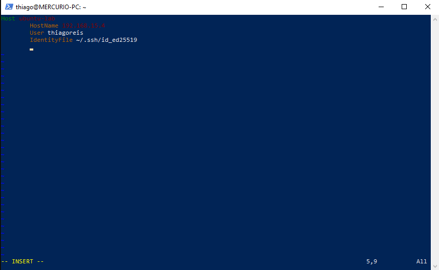 </p>
<p align="right"><i>(Imagem: WSL/Ubuntu via PowerShell)</i>

<br></br>


#### Testando o Acesso

Vamos testar o acesso a máquina virtual (VM) utilizando o WSL/Ubuntu no Windows.

```bash
ssh ubuntu-lab
```

<p align="center"> 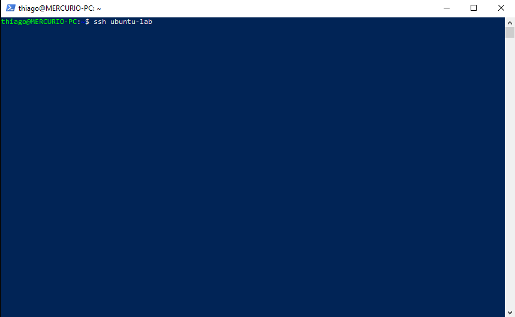 </p>
<p align="right"><i>(Imagem: WSL/Ubuntu via PowerShell)</i>

<br></br>

Para o primeiro acesso, digite a senha do usuário da máquina virtual...

<p align="center">  </p>
<p align="right"><i>(Imagem: WSL/Ubuntu via PowerShell)</i>

<br></br>

Ao conectar na máquina virtual, o terminal exibe a mensagem de boas vindas.

<p align="center"> 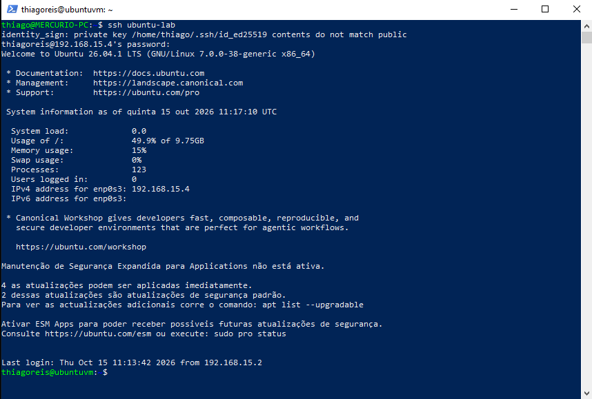 </p>
<p align="right"><i>(Imagem: WSL/Ubuntu via PowerShell)</i>

<br></br>

#### Terminal WSL/Ubuntu

Abaixo, segue imagens do terminal do WSL/Ubuntu atualizando a lista de pacotes e versões disponíveis nos repositorios, além de baixar e instalar as novas versões dos pacotes... 

```bash
apt-get update
```

<p align="center"> 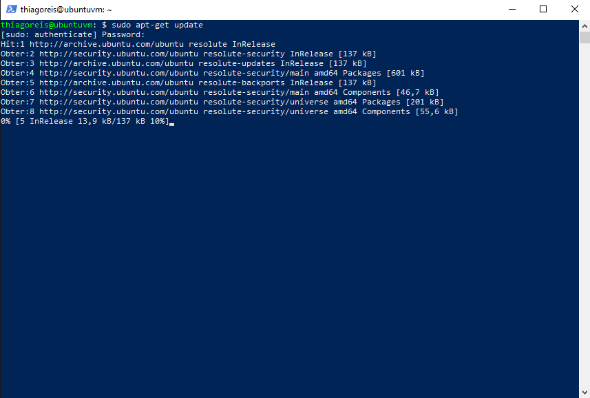 </p>
<p align="right"><i>(Imagem: WSL/Ubuntu via PowerShell)</i>

<br></br>

```bash
apt-get upgrade
```

<p align="center"> 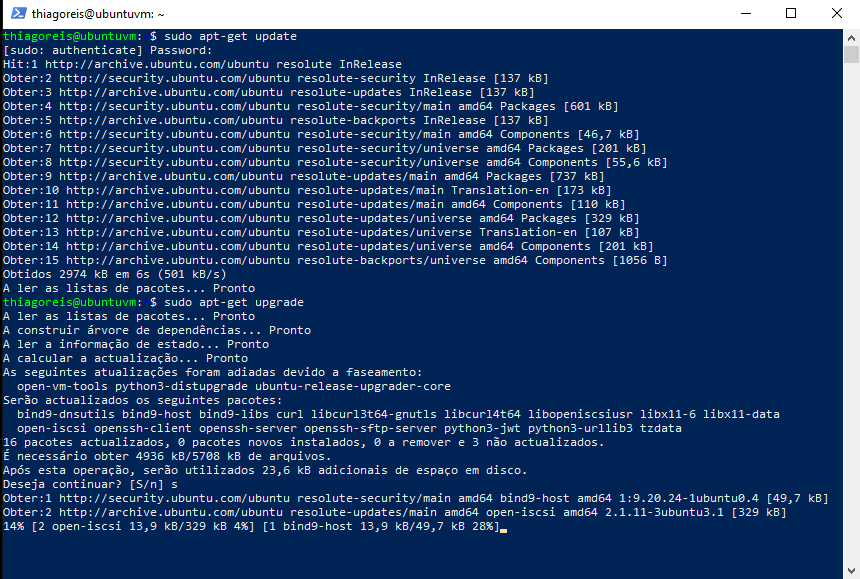 </p>
<p align="right"><i>(Imagem: WSL/Ubuntu via PowerShell)</i>

<br></br>

---

<br></br>

## 7. Resultado

Ao concluir as etapas, o laboratório deverá ter:

- Uma chave SSH Ed25519 gerada no Windows.
- A chave pública instalada no Ubuntu Server.
- A autenticação por chave SSH testada.
- Um alias configurado no arquivo `~/.ssh/config`.
- O acesso à máquina virtual realizado utilizando o alias definido.

