# Laboratório com Oracle VirtualBox e Ubuntu Server

Este guia mostra, de forma prática, o processo de instalação do Oracle VirtualBox no Windows, a criação e configuração de uma máquina virtual e a instalação do Ubuntu Server.

A proposta é montar um ambiente de laboratório usando recursos do próprio computador, permitindo rodar um sistema Linux de forma isolada dentro do Windows.

Esse tipo de ambiente é útil para estudar Linux, servidores, redes, Docker, DevOps e outras áreas ligadas à infraestrutura.

---

<br></br>

## O que é virtualização

Virtualização é uma tecnologia que permite criar computadores virtuais dentro de um computador físico.

Em vez de instalar um sistema operacional direto no hardware, usamos um software de virtualização para criar uma máquina virtual com recursos próprios, como memória RAM, processador, armazenamento e interface de rede.

Neste laboratório, o computador físico usa Windows como sistema principal. Dentro dele roda o Oracle VirtualBox, que cria e executa uma máquina virtual com Ubuntu Server.

De forma simplificada, a estrutura fica assim:

```
Computador físico
       |
       v
    Windows
       |
       v
   VirtualBox
       |
       v
Máquina Virtual
       |
       v
Ubuntu Server
```

---

<br></br>

## O que é o Oracle VirtualBox

O Oracle VirtualBox é uma plataforma de virtualização que permite criar e executar máquinas virtuais em um computador físico.

Uma máquina virtual usa recursos do computador hospedeiro para funcionar. Esses recursos podem ser distribuídos conforme a necessidade do laboratório, como quantidade de memória RAM, processadores virtuais, espaço em disco e configuração de rede.

Durante este guia, alguns conceitos aparecem com frequência:

- **Host**: computador físico onde o VirtualBox está instalado.
- **Guest**: sistema operacional que roda dentro da máquina virtual.
- **Máquina virtual**: computador virtual criado pelo VirtualBox.
- **Virtualização**: tecnologia usada para disponibilizar recursos virtuais para a máquina.

---

<br></br>

## Pré-requisitos

Antes de começar, vale conferir se o computador tem recursos suficientes para rodar uma máquina virtual.
<br></br>
- Windows compatível com a versão do VirtualBox utilizada.
- Processador com suporte à virtualização.
- Memória RAM disponível para o sistema convidado.
- Espaço livre em disco.
- Permissão para instalar programas no Windows.
- Conexão com a internet para baixar os instaladores e a imagem ISO do Ubuntu Server.

<br></br>

<p>A máquina virtual compartilha os recursos do computador físico. Por isso, a quantidade de RAM, capacidade de processamento e espaço em disco devem ser consideradas antes de definir a configuração.</p>

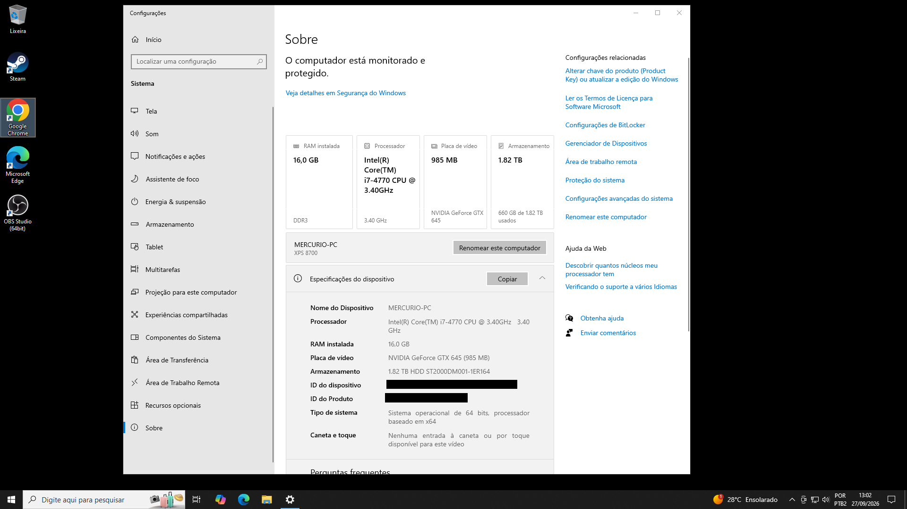
<p align="right"><i>(Imagem 01: Representação do computador físico onde será instalado o Oracle VirtualBox)</i>

<br></br>

### Ativação do Hypervisor na BIOS (em desenvolvimento)

<p>Para executar a máquina virtual (<strong>Nome da VM: ubuntu-lab</strong>), é necessário ativar o Hypervisor / Virtualização nas configurações da sua BIOS.</p>

<h3>Como acessar a BIOS</h3>

<p>Reinicie o computador e fique pressionando a tecla de acesso da sua placa-mãe. As mais comuns são:</p>
<ul>
  <li><strong>DEL</strong> ou <strong>F2</strong> (Na grande maioria das placas-mãe como ASUS, Gigabyte, ASRock)</li>
  <li><strong>F1</strong> ou <strong>F12</strong> (Comum em notebooks e computadores da Lenovo, Dell ou HP)</li>
</ul>

<h3>Onde encontrar a opção (Geralmente na aba "Advanced" ou "CPU Configuration")</h3>
<p>O nome da função muda de acordo com o fabricante do seu processador:</p>
<ul>
  <li><strong>Pocessadores Intel:</strong> Procure por <em>Intel Virtualization Technology</em>, <em>Intel VT-x</em> ou <em>VT-d</em> e mude para <strong>Enabled</strong>.</li>
  <li><strong>Processadores AMD:</strong> Procure por <em>SVM Mode</em> (Secure Virtual Machine) ou <em>AMD-V</em> e mude para <strong>Enabled</strong>.</li>
</ul>

<hr size="1" color="gray">

<h3>Mensagem de Erro (Caso a Virtualização esteja Desativada):</h3>

<pre>
Not in a hypervisor partition (HVP=0) (VERR_NEM_NOT_AVAILABLE).
VT-x is disabled in the BIOS for all CPU modes (VERR_VMX_MSR_ALL_VMX_DISABLED).
Código de Resultado: E_FAIL (0x80004005)
Componente: ConsoleWrap
Interface: IConsole {6ac83d89-6ee7-4e33-8ae6-b257b2e81be8}
</pre>

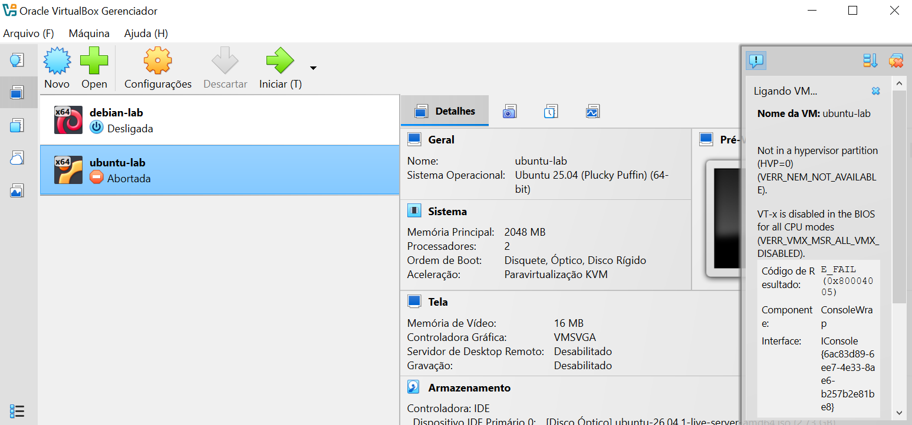
<p align="right"><i>(Imagem 02: Mensagem de Erro no VirtualBox / Hypervisor)</i>

---

<br></br>

## Obtendo o instalador do VirtualBox

O primeiro passo é baixar o instalador do Oracle VirtualBox.

A versão usada neste laboratório deve ser obtida direto na página oficial do projeto.

<a href="https://www.virtualbox.org/wiki/Downloads">Página oficial de download do Oracle VirtualBox</a>

<br></br>
Na página de downloads, localize a opção correspondente ao Windows e faça o download do instalador.

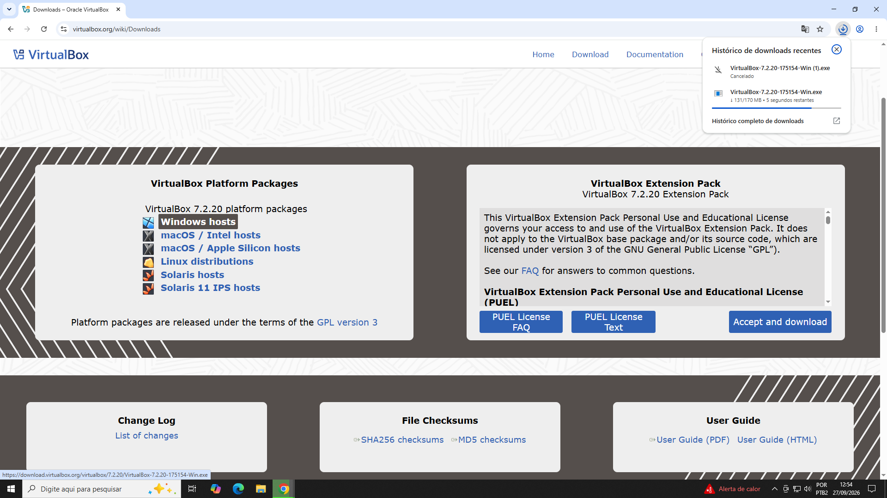
<p align="right"><i>(Imagem 03: Página de download do Oracle VirtualBox)</i>

---

<br></br>

## Obtendo a imagem ISO do Ubuntu Server

Além do VirtualBox, será necessária uma imagem ISO do Ubuntu Server para instalar o sistema operacional na máquina virtual.

A imagem pode ser obtida direto no site oficial do Ubuntu:

<a href="https://ubuntu.com/download/server">Página oficial de download do Ubuntu Server</a>

<br></br>
Na página, escolha a versão **Ubuntu Server 22.04 LTS** e faça o download.

Após concluir o download, mantenha o arquivo ISO em um local de fácil acesso. Ele será usado durante a criação e configuração da máquina virtual.

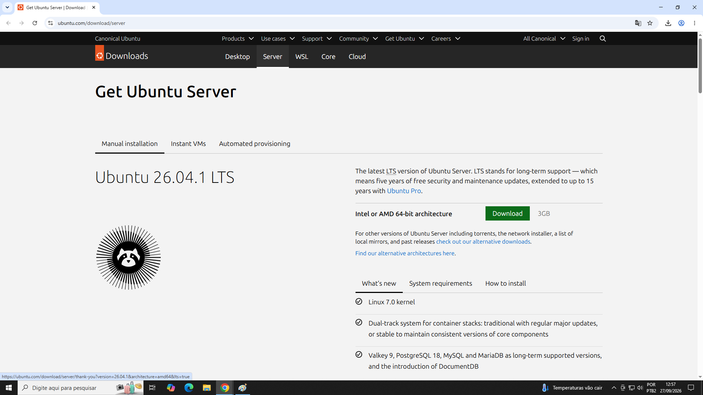
<p align="right"><i>(Imagem 04: Página oficial de download da imagem ISO do Ubuntu Server)</i>

---

<br></br>

## Local onde o download do VirtualBox foi salvo

Após realizar o download, localize o arquivo de instalação e execute.

O Windows geralmente salva o arquivo na pasta "Donwloads" conforme representação da imagem abaixo.

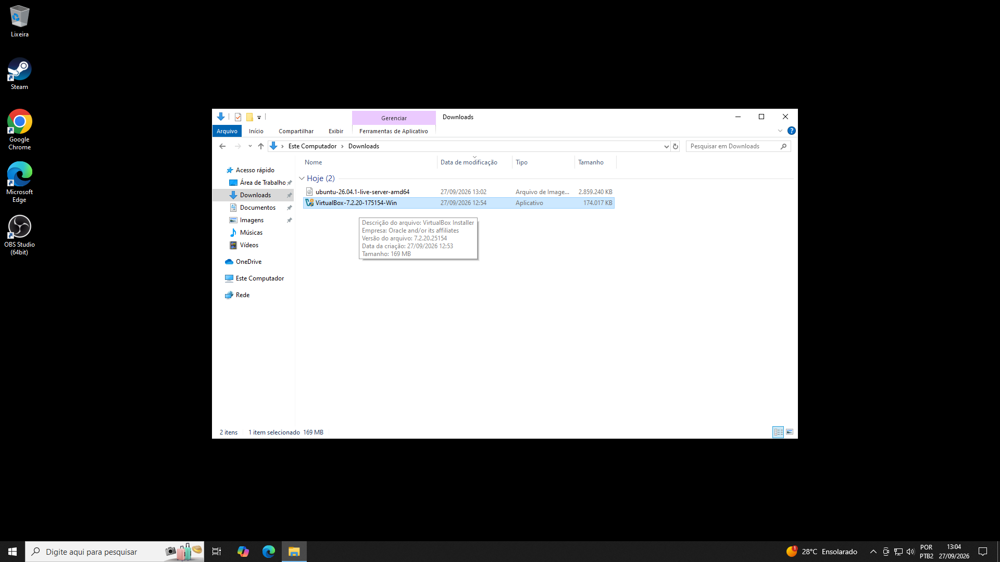
<p align="right"><i>(Imagem 05: Local onde está o executavel do Oracle VirtualBox)</i>

---

<br></br>

## Instalando o VirtualBox

Execute o arquivo de instalação, primeiramente o Windows pode solicitar a autorização para rodar o instalador. Confirme para iniciar o processo.

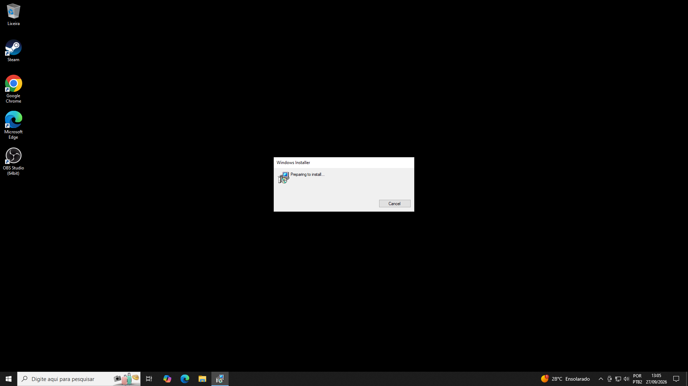
<p align="right"><i>(Imagem 06: Executando a instalação do Oracle VirtualBox)</i>

---

<br></br>

## Tela de Boas Vindas do VirtualBox

Após confirmar a execução da etapa anterior, o instalador mostra a tela de boas vindas do Oracle VirtualBox.

Nesta tela o instalador informa que será instalado o VirtualBox no computador, é possível também ver a versão utilizada.  

Clique em "Next" para iniciar o processo de instalação.


<p align="right"><i>(Imagem 07: Tela de Boas Vindas do Oracle VirtualBox)</i>

---

<br></br>

## Termos de licença

Nesta etapa, o instalador mostra os termos de licença do Oracle VirtualBox.

Leia os termos e marque a opção de aceite para continuar.

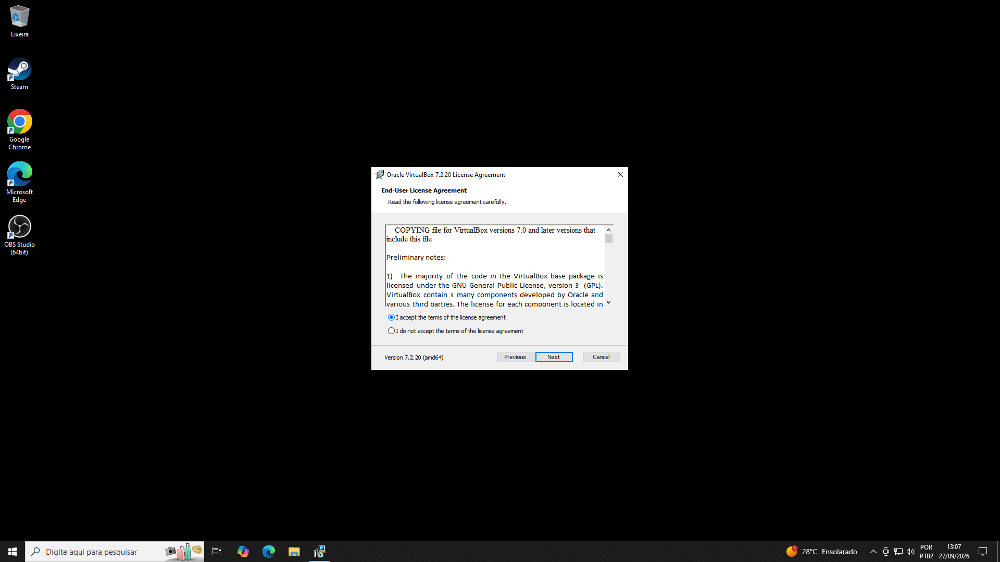
<p align="right"><i>(Imagem 08: Termos de licença do Oracle VirtualBox)</i>

---

<br></br>

## Selecionando os componentes

O instalador mostra os componentes que serão instalados junto com o VirtualBox.

Para este laboratório, as opções padrão podem ser mantidas.

Entre os componentes estão os recursos necessários para executar as máquinas virtuais, suporte à rede virtual e integração com alguns dispositivos.

<br></br>

### Diretório de instalação

Nesta etapa é possível definir o diretório onde o VirtualBox será instalado.

Para este laboratório, será usado o diretório padrão sugerido pelo instalador.

Caso exista uma necessidade específica, o diretório pode ser alterado conforme a organização do sistema.

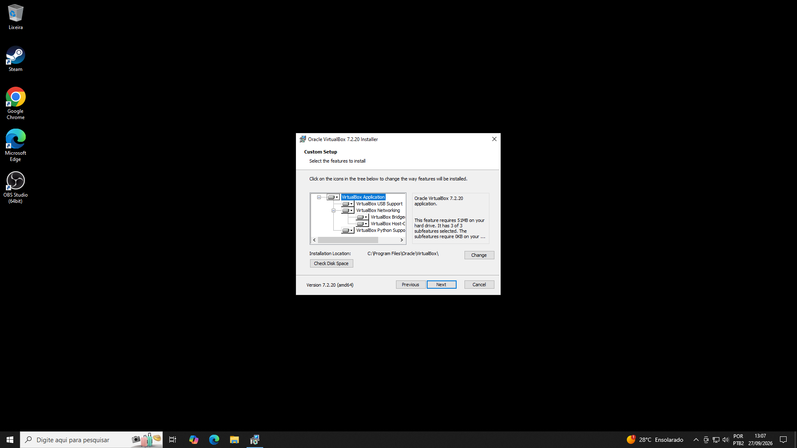
<p align="right"><i>Imagem 09: Definindo o diretório de instalação do Oracle VirtualBox)</i>

---

<br></br>

## Dependências ausentes (Missing Dependencies)

O instalador pode exibir um aviso sobre dependências ausentes do Python (Python Core / win32api).

Esse aviso está relacionado aos bindings Python do VirtualBox, usados para automação via linha de comando. Para este laboratório, clique em **Yes** (Sim) para continuar a instalação normalmente e ignorar o aviso.

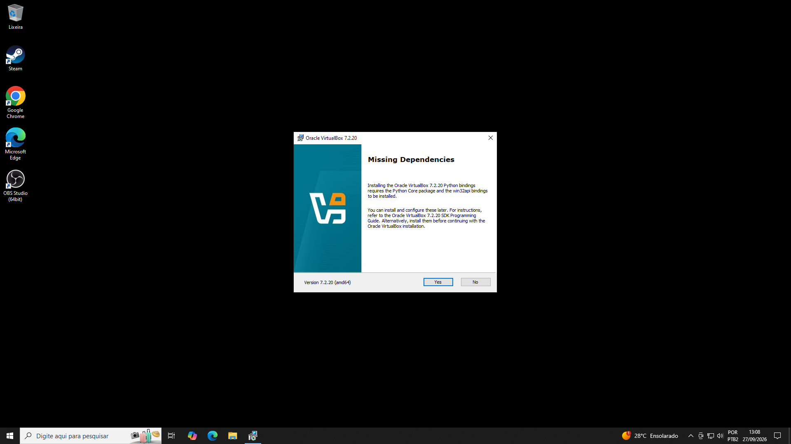
<p align="right"><i>(Imagem 10: Aviso sobre dependências do Python no Oracle VirtualBox)</i>

---

<br></br>

## Componentes de rede

O VirtualBox instala componentes necessários para disponibilizar interfaces de rede virtuais para as máquinas virtuais.

Durante essa etapa, o Windows pode informar que a conexão de rede será temporariamente interrompida enquanto os componentes são instalados.

Confirme a instalação para continuar.


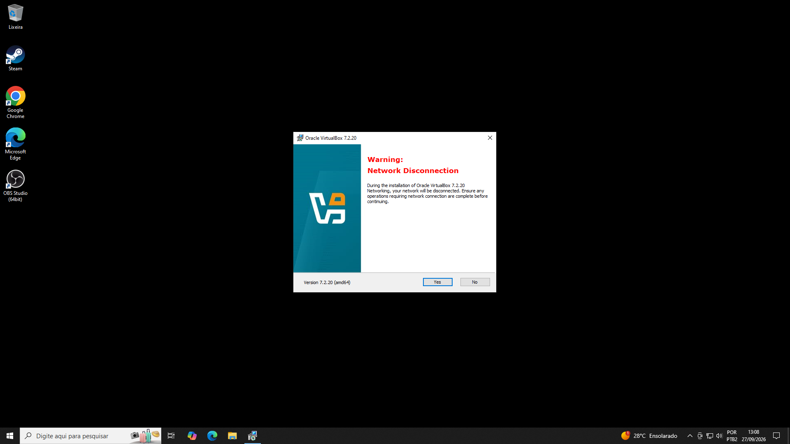
<p align="right"><i>(Imagem 11: Aviso sobre os componentes de rede virtuais)</i>

---

<br></br>

### Atalhos e associações de arquivos

O instalador permite selecionar atalhos e associações de arquivos que serão criados no Windows.

Para este laboratório, as opções padrão podem ser mantidas.

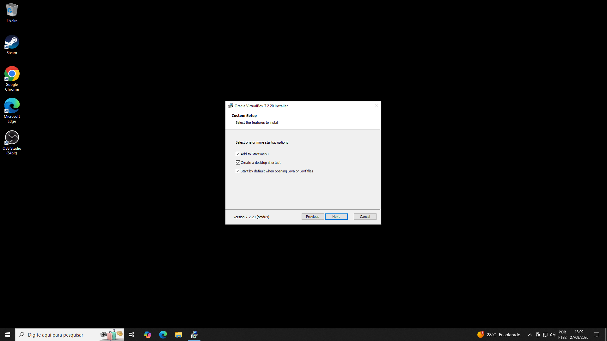
<p align="right"><i>(Imagem 12: Definindo atalhos e associações de arquivos)</i>

---

<br></br>

### Pronto para instalar

Após definir as configurações do VirtualBox, o instalador aguarda a confirmação para prosseguir.

Clique em "Install" (Instalar) para iniciar este processo.

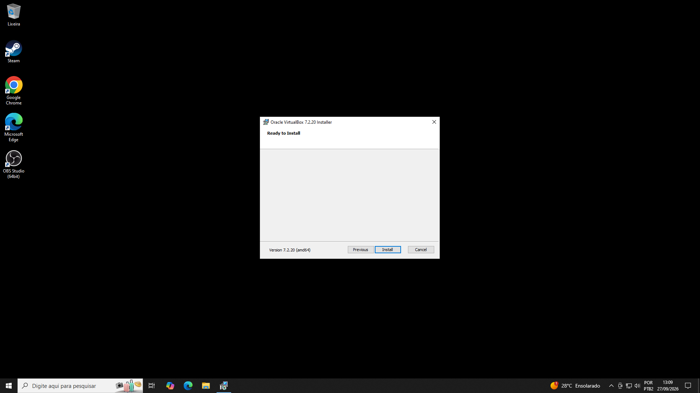
<p align="right"><i>(Imagem 13: Tela de confirmação para iniciar a instalação do Oracle VirtualBox)</i>

---

<br></br>

### Iniciando a instalação

Depois de revisar as opções, inicie a instalação do VirtualBox.

O instalador copiará os arquivos necessários e fará as configurações.

Dependendo da configuração do Windows, o sistema pode pedir autorização para instalar drivers usados pelo VirtualBox para recursos como interfaces de rede e outros dispositivos. Caso isso ocorra, confirme a instalação.

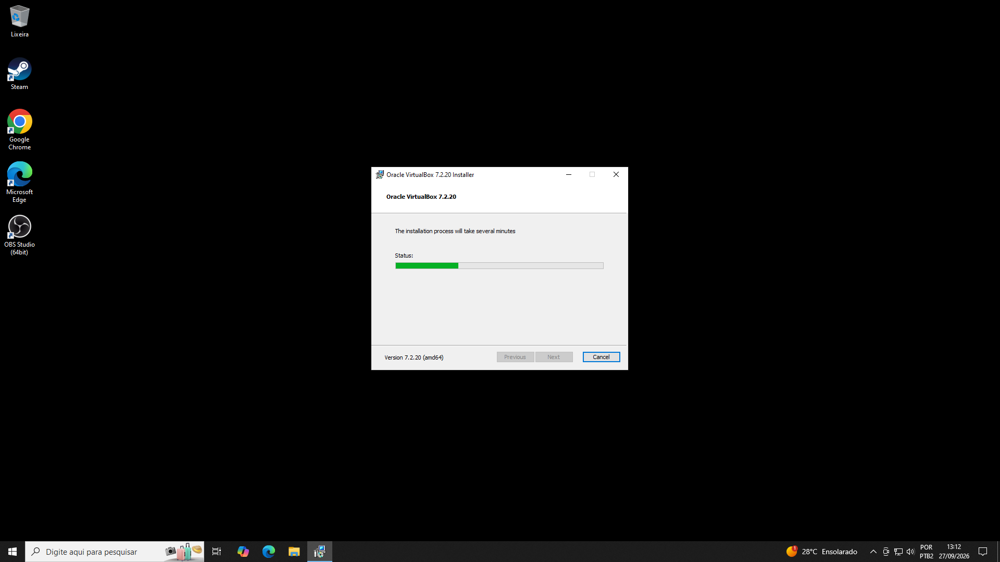
<p align="right"><i>(Imagem 14: Iniciando a instalação / barra de progresso)</i>


---

<br></br>

### Finalizando a instalação

Ao finalizar, o instalador mostra a confirmação de que o Oracle VirtualBox foi instalado.

Finalize o instalador e abra o VirtualBox para começar a configuração do ambiente.

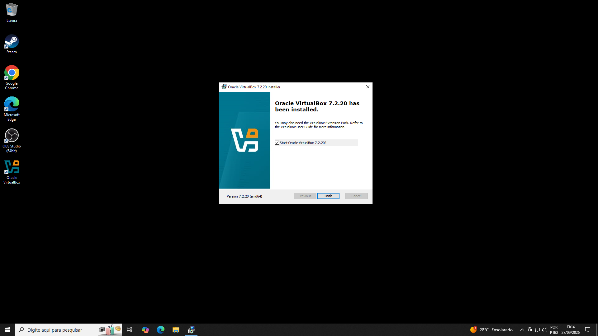
<p align="right"><i>(Imagem 15: Finalizando a instalação)</i>

---

<br></br>

## Abrindo o VirtualBox

Ao abrir o VirtualBox, será apresentada a interface principal do VirtualBox Manager.

Como é uma instalação nova, inicialmente não haverá máquinas virtuais cadastradas.

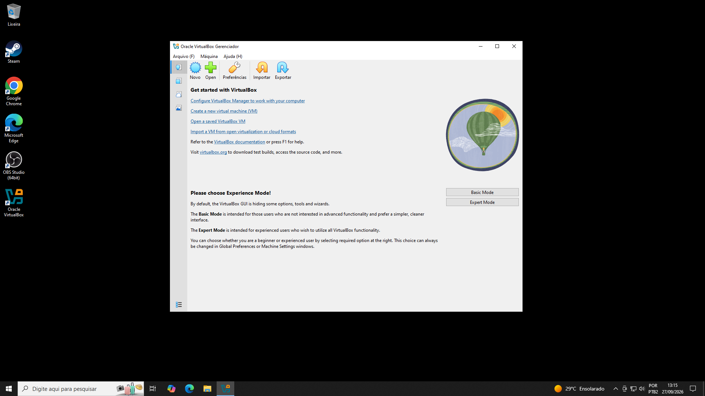
<p align="right"><i>(Imagem 16: Abrindo o VirtualBox / criando a primeira VM)</i>

---

<br></br>

## Verificando a instalação (opcional)

Além da interface gráfica, o VirtualBox disponibiliza ferramentas de linha de comando.

Uma forma simples de verificar a versão instalada é usar o comando `VBoxManage`

Para fazer a verificação, abra o Prompt de Comando  (CMD) ou o PowerShell do Windows e acesse a pasta:

```bash
cd "C:\Program Files\Oracle\VirtualBox"
```

Após abrir o prompt, digite:

```bash
VBoxManage --version
```

Caso o comando não seja reconhecido, feche e abra novamente o Prompt para que o PATH seja atualizado.

O comando deve mostrar a versão do VirtualBox instalada.


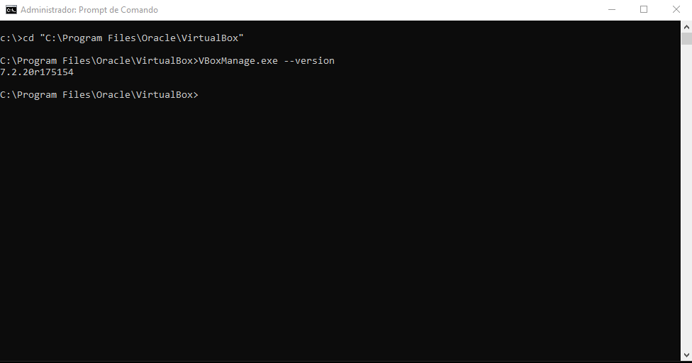
<p align="right"><i>(Imagem 17: Verificando a instalação do Oracle VirtualBox pelo Prompt de Comando)</i>

---

<br></br>

## Criando uma nova máquina virtual

Com o VirtualBox instalado, podemos criar a máquina virtual que será usada neste laboratório.

Na interface principal do VirtualBox, selecione a opção para criar uma nova máquina virtual.

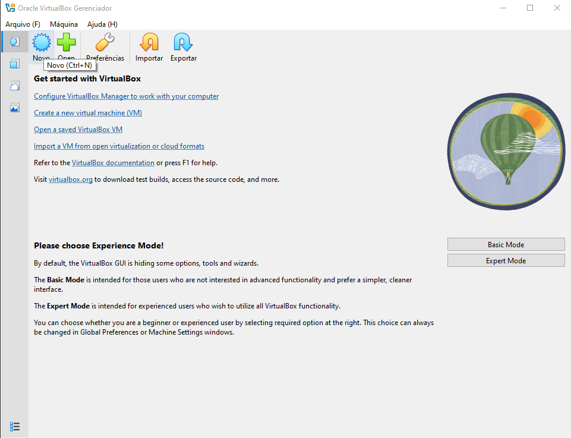
<p align="right"><i>(Imagem 18: Criando uma nova máquina virtual)</i>

---

<br><br>

### Definindo o nome e o sistema operacional

Na primeira etapa da criação, informe o nome da máquina virtual e selecione o sistema operacional que será instalado.

Para este laboratório, usaremos o Ubuntu Server.

Defina um nome que facilite a identificação da máquina. Usaremos `ubuntu-lab`.

```
Nome da máquina virtual: ubuntu-lab
Sistema operacional: Linux
Distribuição: Ubuntu (64-bit)
```

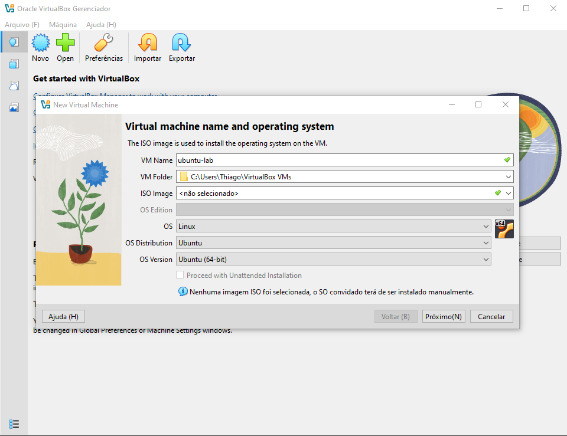
<p align="right"><i>(Imagem 19: Definindo o nome da máquina virtual e o sistema operacional)</i>

---

<br></br>

### Selecionando a imagem ISO

O VirtualBox permite informar a imagem ISO que será usada para instalar o sistema operacional.

Neste laboratório, será usada uma imagem ISO do Ubuntu Server.

A imagem pode ser obtida direto no site oficial do Ubuntu.

[Página oficial de download do Ubuntu Server](https://ubuntu.com/download/server)

Após o download, selecione a imagem ISO no assistente de criação da máquina virtual.


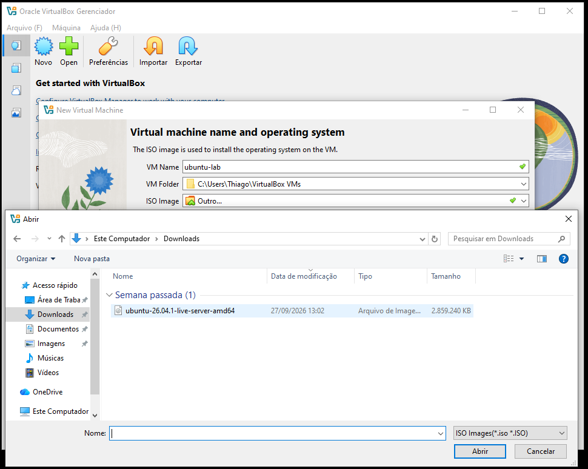
<p align="right"><i>(Imagem 20: Selecionando a imagem ISO no Oracle VirtualBox)</i>

---

<br></br>

### Instalação não assistida

O VirtualBox pode oferecer uma instalação automatizada do sistema convidado.

Neste laboratório, será usada a instalação manual do Ubuntu Server, permitindo acompanhar cada etapa do processo.

Caso essa opção seja apresentada, desmarque a instalação não assistida e siga com a configuração manual.


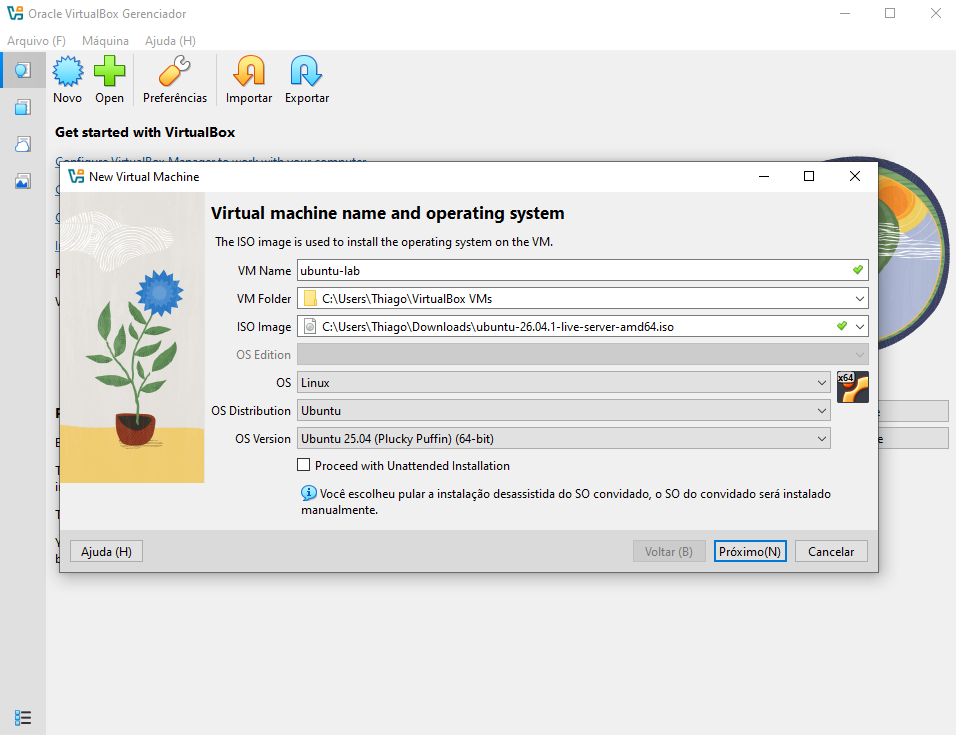
<p align="right"><i>(Imagem 21: Tela de instalação da máquina virtual, opção de instalação assistida)</i>

---

<br></br>

### Configurando a memória RAM

A memória RAM da máquina virtual será reservada a partir da memória disponível no computador físico.

Para um laboratório básico com Ubuntu Server, uma quantidade moderada de memória costuma ser suficiente. A configuração deve levar em conta a memória total disponível no computador.

Neste laboratório, usaremos:

```
Memória RAM da máquina virtual: 2048 MB
```
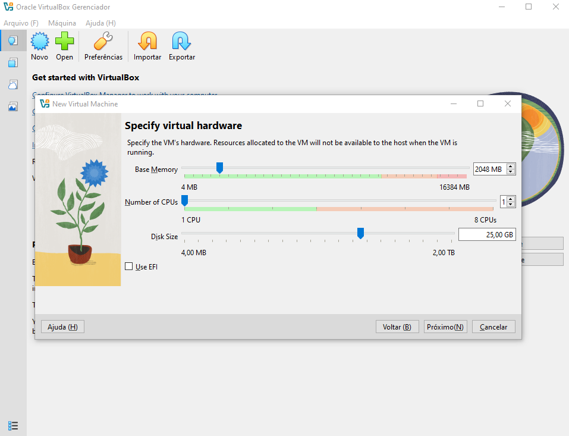
<p align="right"><i>(Imagem 22: Tela de criação da VM, definindo o tamanho da memória RAM)</i>

---

<br></br>

### Configurando os processadores

Assim como a memória, os processadores usados pela máquina virtual são recursos disponibilizados pelo computador físico.

Para este laboratório, usaremos:

```
Processadores virtuais: 2
```

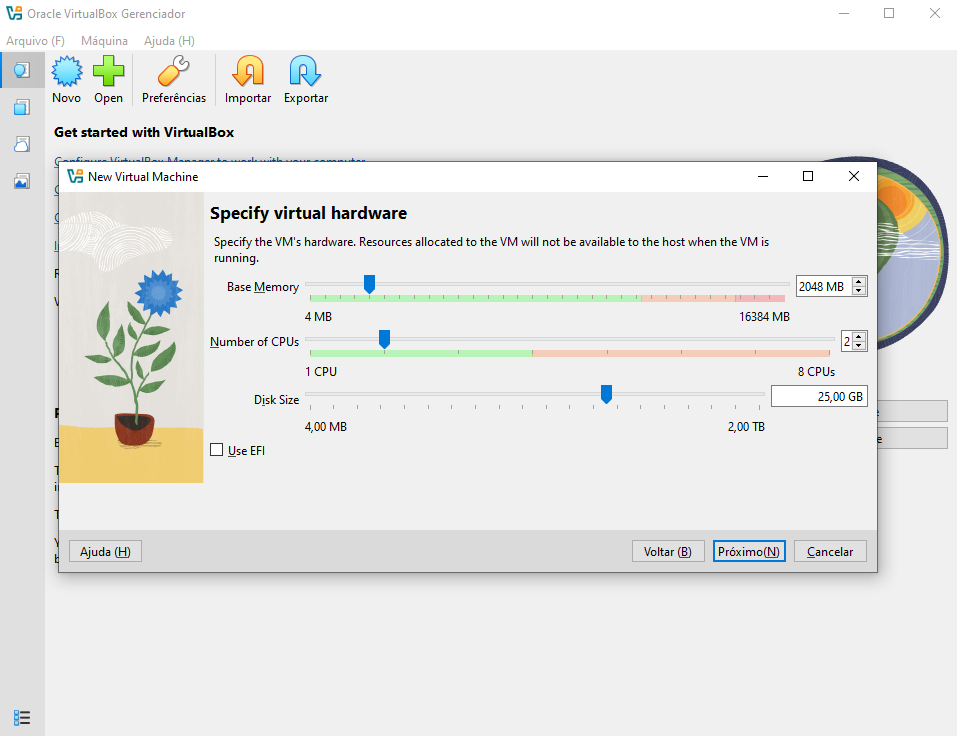
<p align="right"><i>(Imagem 23: Tela de criação da VM, configurando os processadores)</i>

---

<br></br>

### Definindo o tamanho do disco

A máquina virtual precisa de um dispositivo de armazenamento para instalar o sistema operacional. O VirtualBox usa arquivos no sistema hospedeiro para representar os discos virtuais.

Neste laboratório, será criado um novo disco virtual com 20 GB.

O tamanho pode ser ajustado conforme os recursos disponíveis e a finalidade do laboratório.

```
Tamanho do disco virtual: 20 GB
```


<p align="right"><i>(Imagem 24: Tela de criação da VM, definindo o tamanho do disco)</i>

---

<br></br>

### Revisando a configuração da máquina virtual

Antes de finalizar a criação, o VirtualBox apresenta um resumo da configuração.

Revise as informações e confirme a criação.

```
Máquina virtual: ubuntu-lab
Memória: 2048 MB
Processadores: 2
Disco virtual: 20 GB
Sistema operacional: Ubuntu Server
```

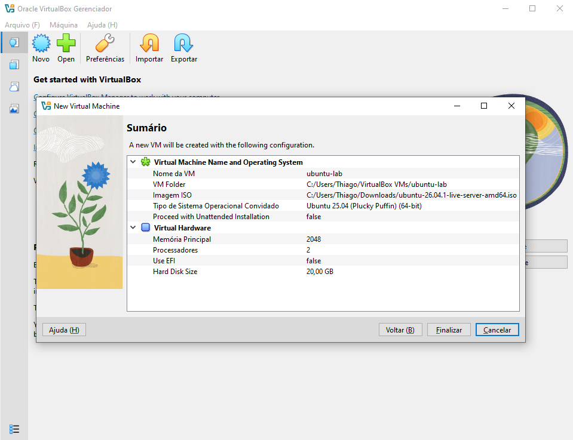
<p align="right"><i>(Imagem 25: Revisando as configurações da máquina virtual)</i>

---

<br></br>

## Configurando a máquina virtual

Depois de criar a máquina virtual, ainda é possível alterar várias configurações antes de iniciá-la.

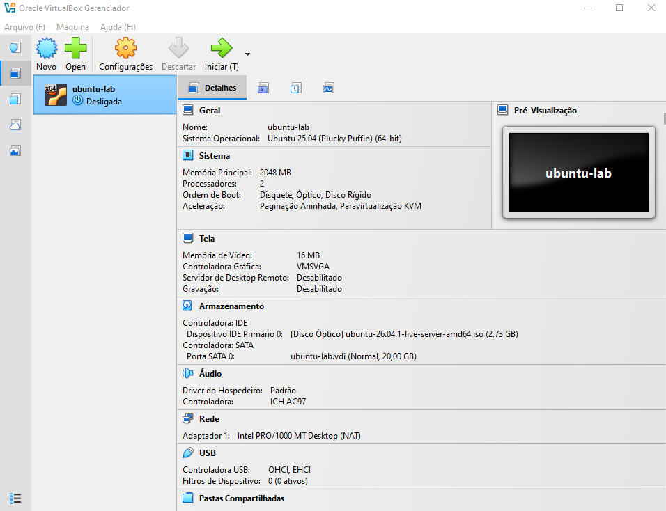
<p align="right"><i>(Imagem 26: Painel Inicial do Oracle VirtualBox)</i>

<br></br>

Entre as configurações disponíveis estão:

- Sistema
- Processadores
- Memória
- Armazenamento
- Rede
- Áudio
- USB
- Pastas compartilhadas

Neste laboratório, o foco inicial será a configuração dos recursos necessários para executar o Ubuntu Server.

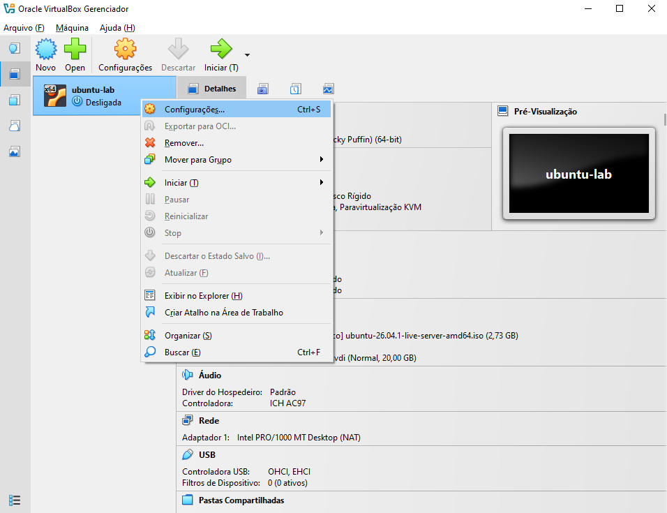
<p align="right"><i>(Imagem 27: Configurando a máquina virtual dentro do Oracle VirtualBox)</i>

---

<br></br>

### Configurando a rede

A configuração de rede é uma das partes mais importantes de um laboratório de máquinas virtuais.

O VirtualBox oferece diferentes modos de conexão: NAT, Bridge, Host-only e outros, cada um voltado a cenários específicos.

Para este laboratório inicial, será usada a configuração **NAT**.

O modo NAT permite que a máquina virtual use a conexão de rede do computador hospedeiro para acessar recursos externos.

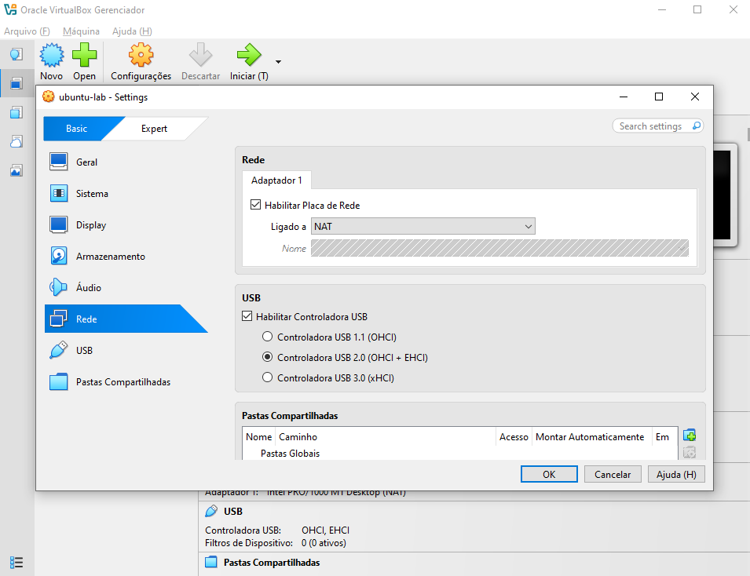
<p align="right"><i>(Imagem 28: Configurando a rede da máquina virtual no Oracle VirtualBox)</i>

---

<br></br>

## Iniciando a máquina virtual

Com a configuração concluída, inicie a máquina virtual.

Ao iniciar, o VirtualBox abrirá uma janela correspondente ao computador virtual e fará o processo de inicialização.

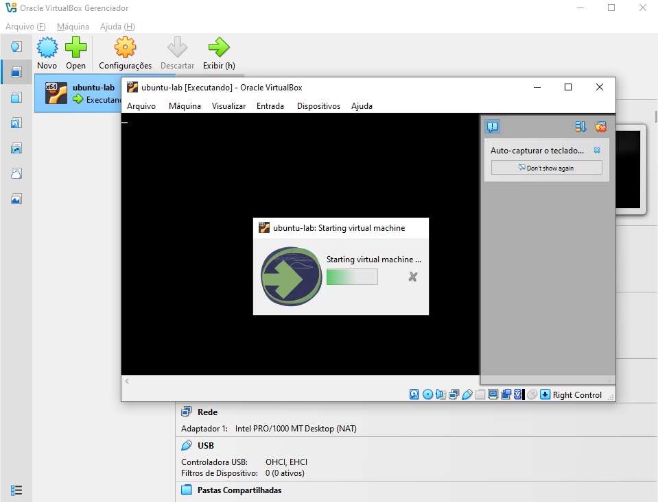
<p align="right"><i>(Imagem 29: Iniciando a máquina virtual)</i>

---

<br></br>

## Iniciando a instalação do Ubuntu Server

Com a imagem ISO montada na máquina virtual, o sistema será iniciado pelo instalador do Ubuntu Server.

O instalador apresenta as opções necessárias para configurar o sistema operacional.

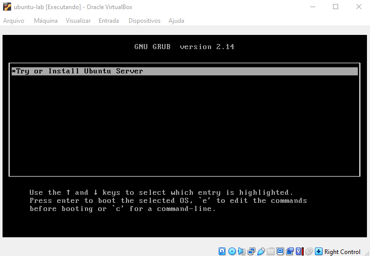
<p align="right"><i>(Imagem 30: Iniciando a instalação do Ubuntu Server na máquina virtual)</i>

---

<br></br>

### Selecionando o idioma

O instalador pede a escolha do idioma que será usado durante a instalação.

Selecione o idioma desejado e continue.

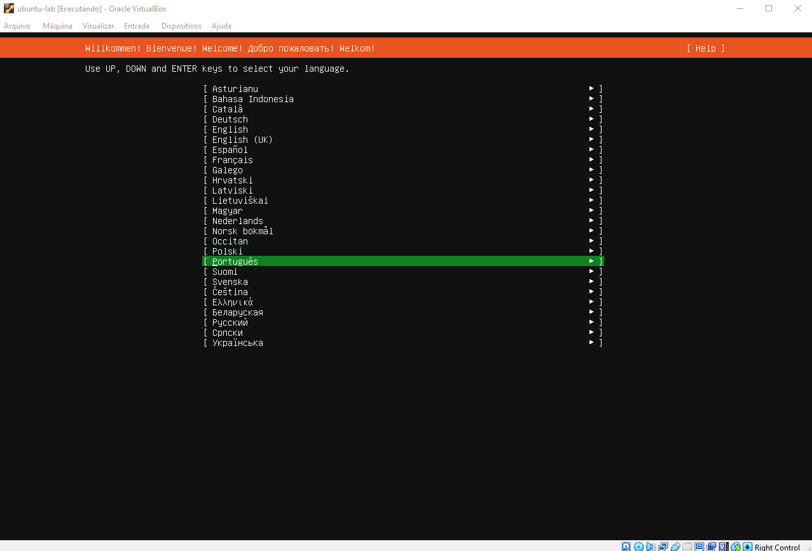
<p align="right"><i>(Imagem 31: Definindo o idioma padrão do sistema durante a instalação)</i>

---

<br></br>

### Configurando o teclado

Durante a instalação, o Ubuntu Server também pede informações sobre o layout do teclado.

Selecione a opção correspondente ao teclado que será usado.

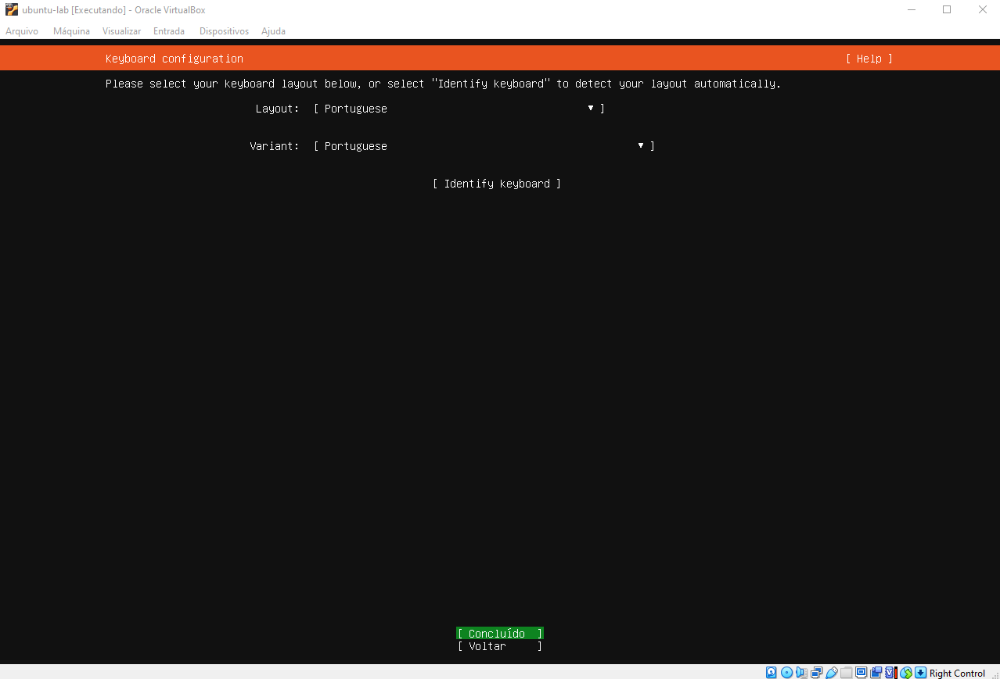
<p align="right"><i>(Imagem 32: Configurando o teclado)</i>

---

<br></br>

### Escolha o tipo de instalação

Nesta etapa é possível escolher o tipo de instalação para o Ubuntu Server, para o exemplo vamos utilizar a opção padrão.

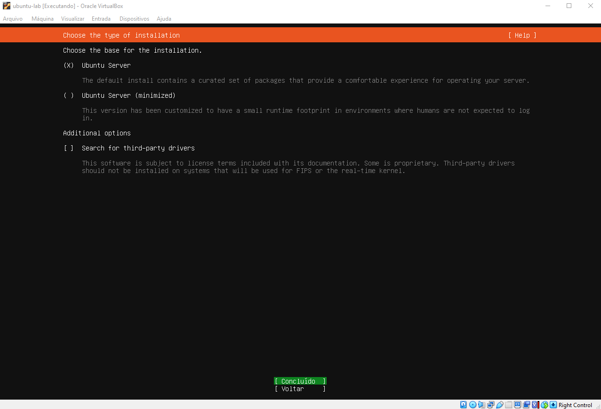
<p align="right"><i>(Imagem 33: Escolha o tipo de instalação para o Ubuntu)</i>

---

<br></br>

### Configurando a rede durante a instalação

O instalador do Ubuntu Server tenta configurar automaticamente a interface de rede da máquina virtual.

Como a máquina está usando NAT no VirtualBox, o sistema deve receber uma configuração de rede automática através do ambiente virtualizado.

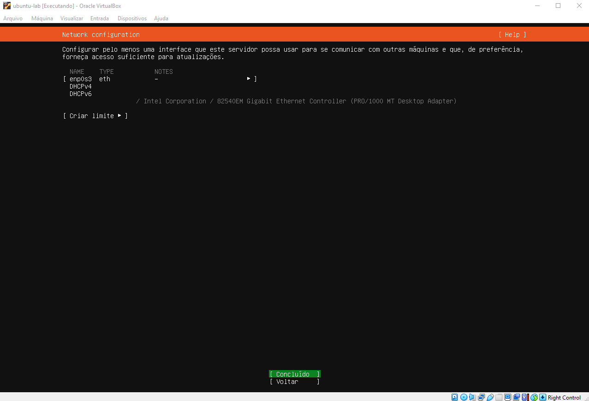
<p align="right"><i>(Imagem 34: Configurando a rede do sistema durante a instalação)</i>

---

<br></br>

### Configurando o proxy

As definições de proxy podem ser ignoradas se você não usa proxy na rede local. Configure apenas se necessário.

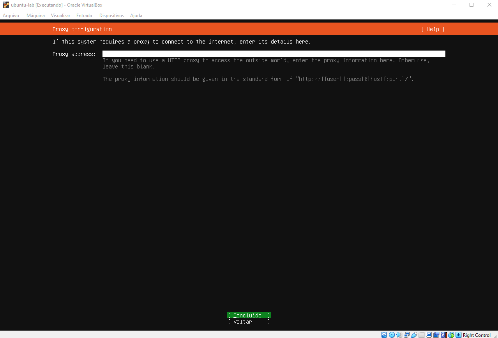
<p align="right"><i>(Imagem 35: Tela de configuração de proxy)</i>

---

<br></br>

### Configurando o espelho do repositório

O instalador pede a confirmação do espelho (mirror) do repositório que será usado.

Escolha o espelho mais próximo da sua região para baixar pacotes mais rápido.

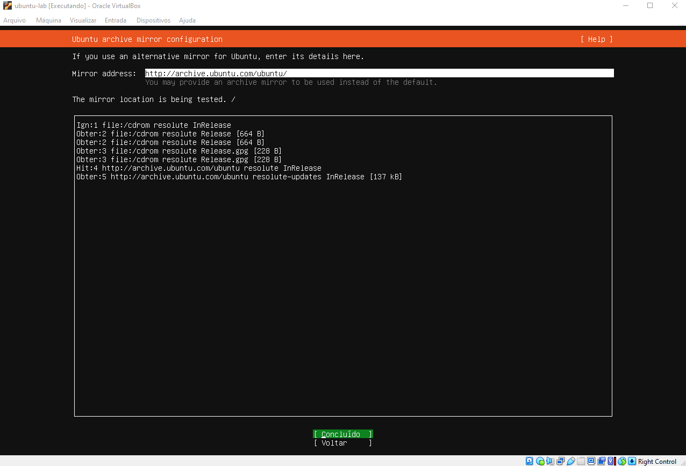
<p align="right"><i>(Imagem 36: Tela de configuração do espelho do repositório)</i>

---

<br></br>

### Configurando o disco

O instalador pede a configuração de armazenamento. Para um laboratório inicial, o particionamento guiado pode ser usado para simplificar.

Neste passo, o processo de instalação usará o disco virtual criado antes no VirtualBox.

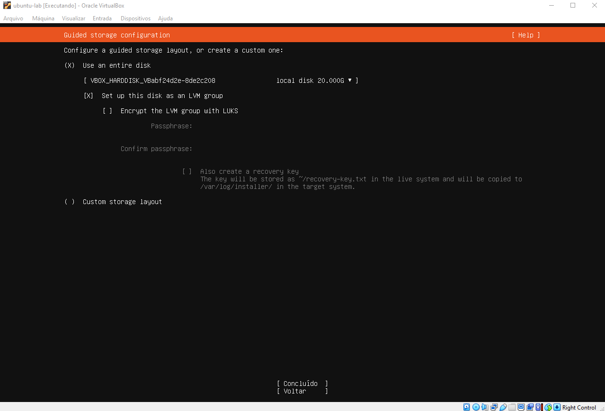
<p align="right"><i>(Imagem 37: Iniciando o particionador)</i>

<br></br>

O particionamento assistido facilita o processo em uma instalação rápida. Neste exemplo, escolhemos o particionamento assistido com uso do disco inteiro.

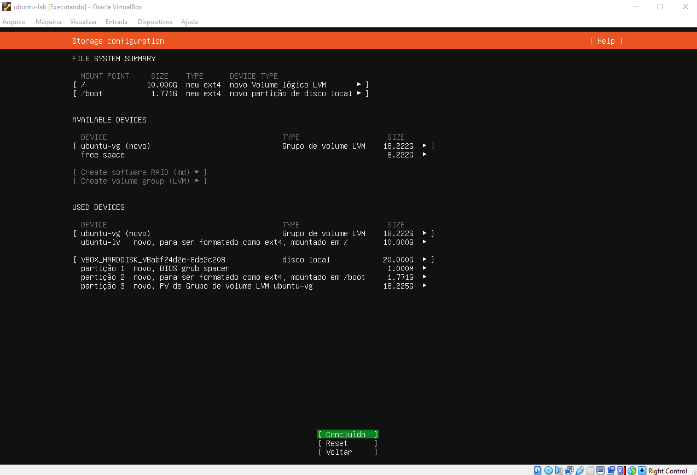
<p align="right"><i>(Imagem 38: Definindo o particionamento)</i>

<br></br>

### Finalizando o particionamento

O sistema apresenta uma visão geral das partições e pontos de montagem. Selecione a opção de finalizar o particionamento e escrever as mudanças no disco. Confirme as alterações e continue.

Em seguida, é necessário confirmar o processo. Observe que todos os dados do disco virtual serão apagados. Selecione o disco a ser particionado.

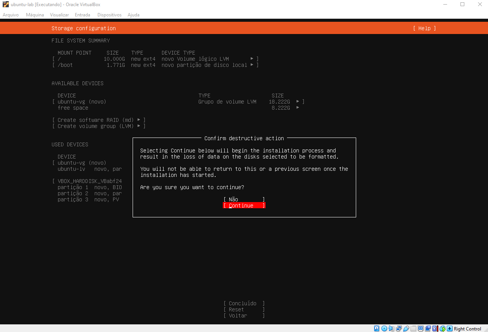
<p align="right"><i>(Imagem 39: Confirmando o disco que será usado na instalação)</i>

---

<br></br>

### Configurando o usuário

Durante a instalação, será necessário definir informações do usuário do sistema.

O Ubuntu Server não cria usuário root com senha por padrão. Em vez disso, cria um usuário comum com privilégios de sudo.

Defina:

- **Nome do usuário**: o nome que será usado para login.
- **Nome do servidor**: o hostname da máquina.
- **Nome de usuário**: o login (por exemplo, `devops`).
- **Senha**: uma senha para esse usuário.

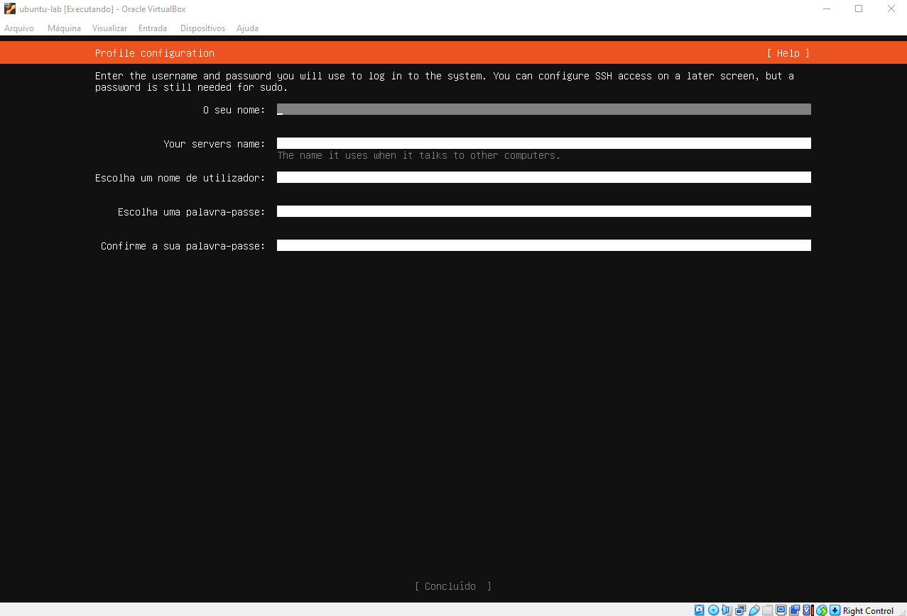
<p align="right"><i>(Imagem 40: Configurando usuário e senha do sistema)</i>

---

<br></br>

### Exemplo da criação do usuário

A imagem abaixo é um exemplo de como devemos preencher os campos.

Após definir o nome de usuário e senha, clique em "Concluído".

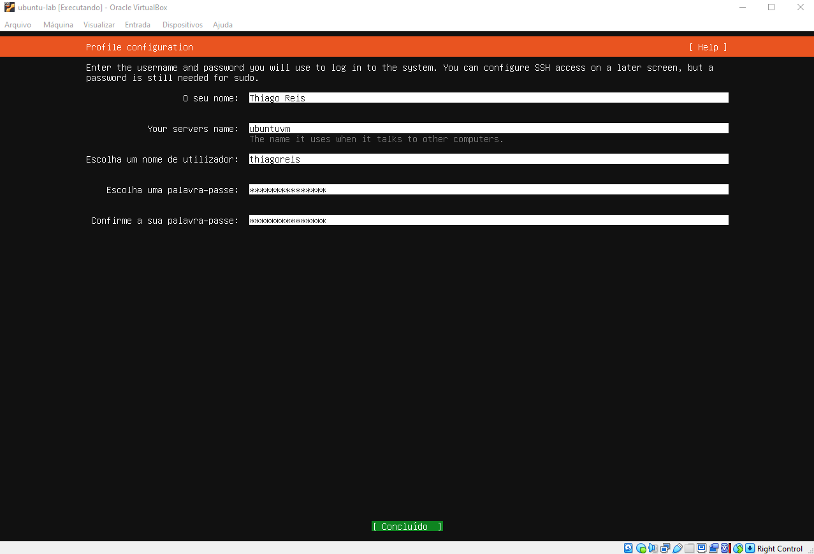
<p align="right"><i>(Imagem 41: Exemplo de criação de usuário no processo de instalação)</i>

---

<br></br>

### Ubuntu Pro

Nesta etapa o instalador informa que é possível atualizar para o Ubuntu Pro.

O Ubuntu Pro é um serviço de assinatura de segurança e conformidade oferecido pela Canonical para estender o suporte ao sistema operacional.

Para este laboratório não é necessário selecionar essa opção.

Marque a opção "Skip for now" e clique em "Continue".

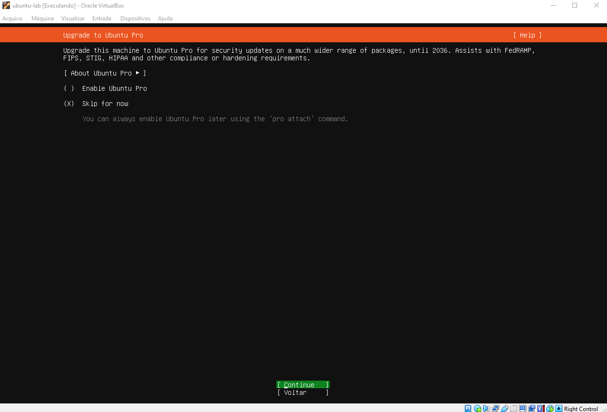
<p align="right"><i>(Imagem 42: Etapa do processo de instalação / Opção Ubuntu Pro)</i>

---

<br></br>

### Configurando o OpenSSH

Agora o instalador do Ubuntu Server pergunta se você quer instalar o servidor OpenSSH.

Para este laboratório, marque a opção para instalar o OpenSSH. Isso permite acessar a máquina virtual via SSH depois.


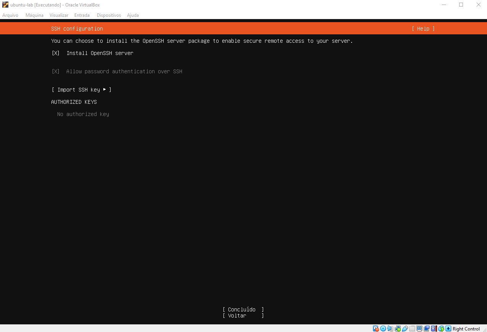
<p align="right"><i>(Imagem 43: Tela de configuração do OpenSSH)</i>

---

<br></br>

### Selecionando Snaps

O Ubuntu Server permite instalar alguns **Snaps** (pacotes de software isolados em containers, projetados para uma instalação simples e segura) pré-configurados durante a instalação.

Para este laboratório, nenhum Snap adicional é necessário. Pule essa etapa.

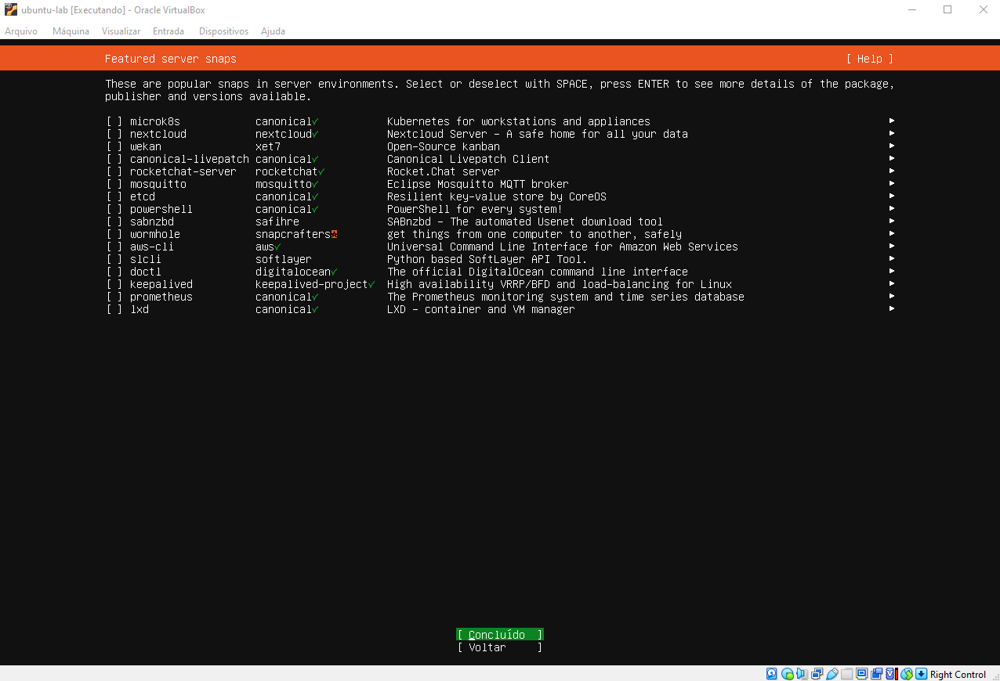
<p align="right"><i>(Imagem 44: Tela de seleção de Snaps)</i>

---

<br></br>

### Instalando o sistema

Depois que as configurações forem definidas, o instalador inicia a instalação dos arquivos do Ubuntu Server no disco virtual.

O tempo necessário depende principalmente do desempenho do computador físico e da configuração da máquina virtual.

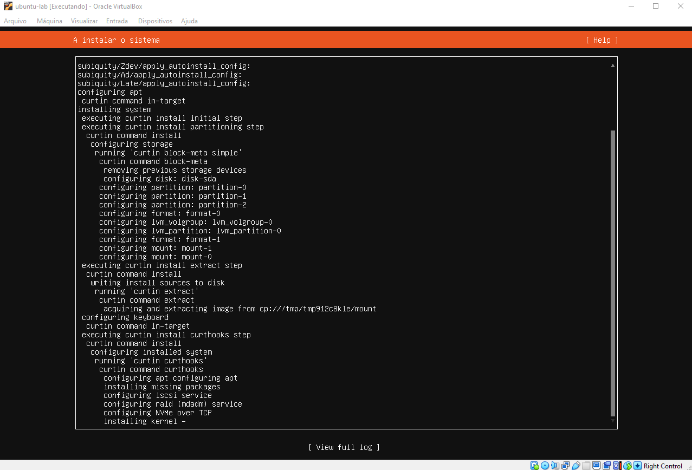
<p align="right"><i>(Imagem 45: Instalando o sistema Ubuntu Server)</i>

---

<br></br>

### Finalizando a instalação

Após a instalação dos pacotes, o instalador mostra uma tela de conclusão.

Escolha a opção de reiniciar o sistema. A máquina virtual irá reiniciar e o Ubuntu Server será carregado a partir do disco virtual.

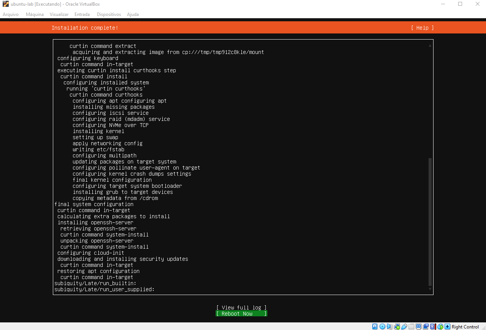
<p align="right"><i>(Imagem 46: Finalizando a instalação do Ubuntu Server)</i>

---

<br></br>

## Primeiro acesso ao Ubuntu Server

Após a reinicialização, será apresentada a tela de login em modo texto.

Utilize o usuário e a senha definidos durante a instalação.

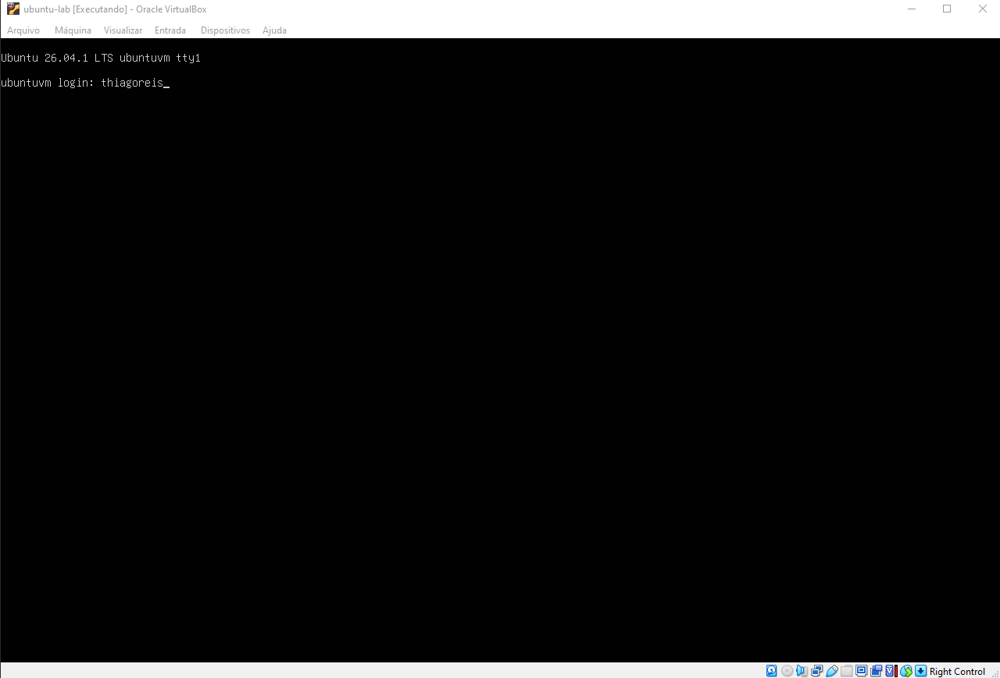
<p align="right"><i>(Imagem 47: Tela de login do Ubuntu Server)</i>


<br></br>

Depois de digitar o seu usuário e senha e pressionar a tecla <kbd>Enter</kbd>, o sistema estará pronto para ser utilizado como ambiente de laboratório.

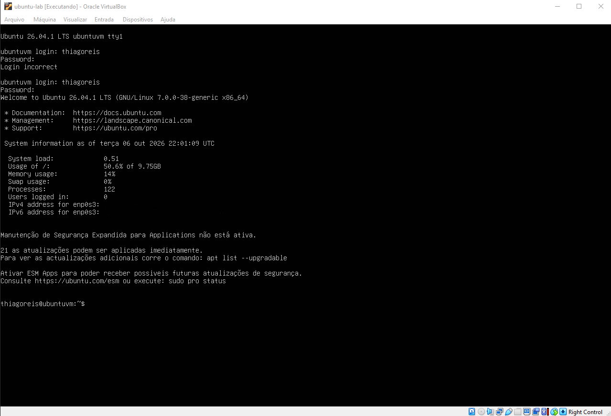
<p align="right"><i>(Imagem 48: Representação do sistema operacional Ubuntu Server)</i>

---

<br></br>

## Verificando o sistema

Acesse o Ubuntu Server e faça algumas verificações básicas para confirmar que o sistema foi instalado corretamente.

Para ver as informações sobre o kernel e a arquitetura do sistema, utilize o comando:

```bash
uname -a
```

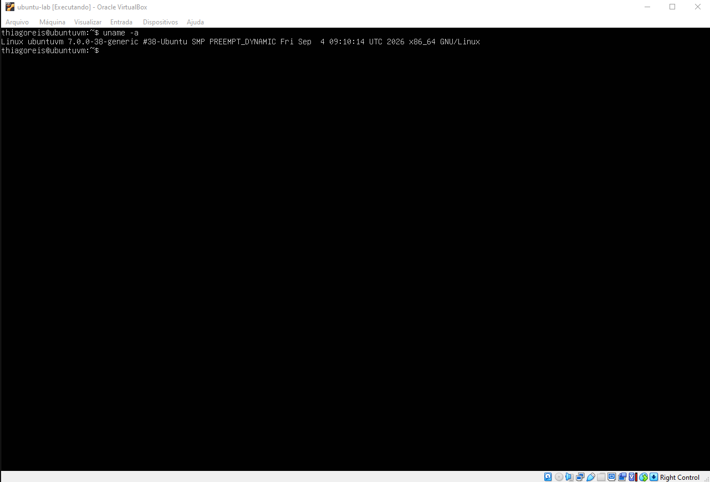
<p align="right"><i>Imagem 49: Consultando informações do kernel no Ubuntu Server pelo terminal)</i>

<br></br>

Para ver informações da distribuição instalada:

```bash
cat /etc/os-release
```
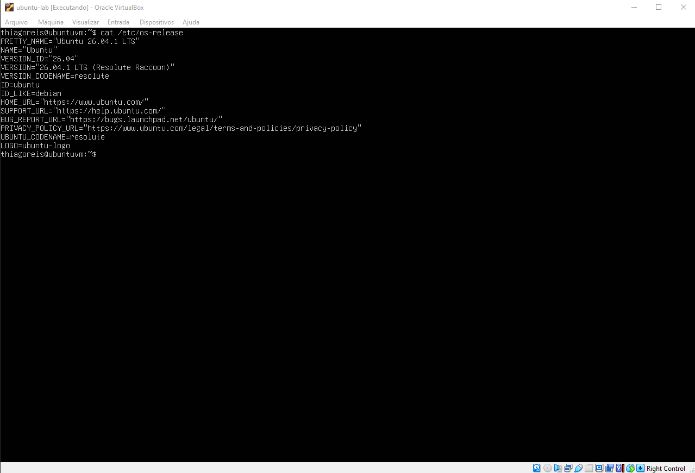
<p align="right"><i>(Imagem 50: Consultando informações da distribuição Ubuntu pelo terminal)</i>

---

<br></br>

### Verificando a memória e os processadores

Para consultar a memória disponível:

```bash
free -h
```

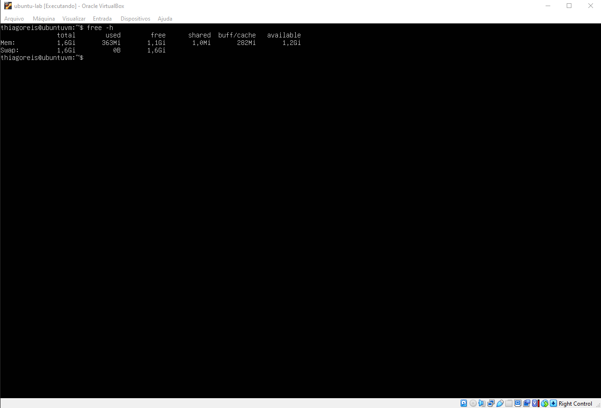
<p align="right"><i>(Imagem 51: Consultando a quantidade de memória disponível utilizando o terminal)</i>

<br></br>

Para verificar os processadores disponíveis:

```bash
nproc
```
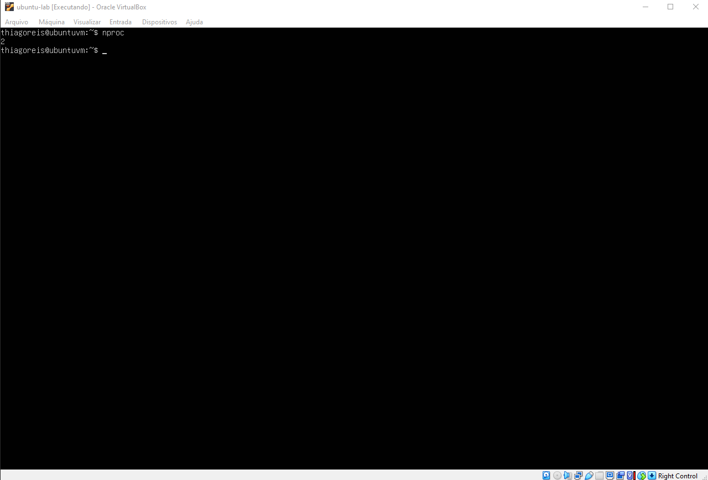
<p align="right"><i>(Imagem 52: Consultando os processadores através do terminal)</i>

---

<br></br>

### Verificando o armazenamento

O comando `df` permite consultar o espaço utilizado e disponível nos sistemas de arquivos:

```bash
df -h
```

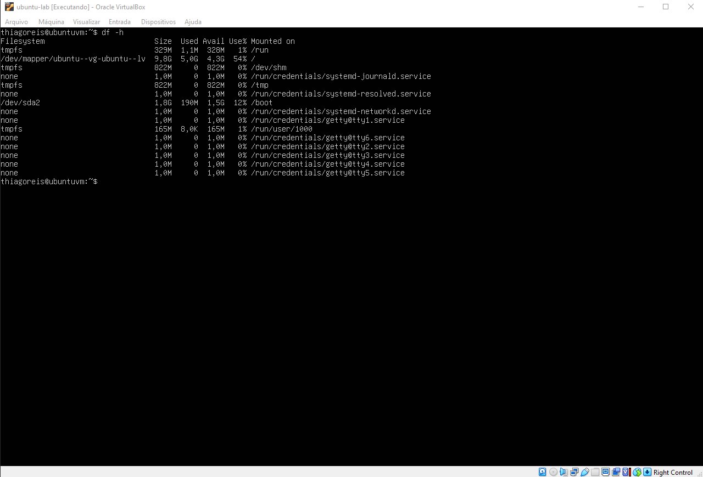
<p align="right"><i>(Imagem 53: Consultando o espaço utilizado e disponível no sistema via terminal)</i>

---

<br></br>

### Verificando a rede

Para ver as interfaces de rede e os endereços IP configurados:

```bash
ip addr
```

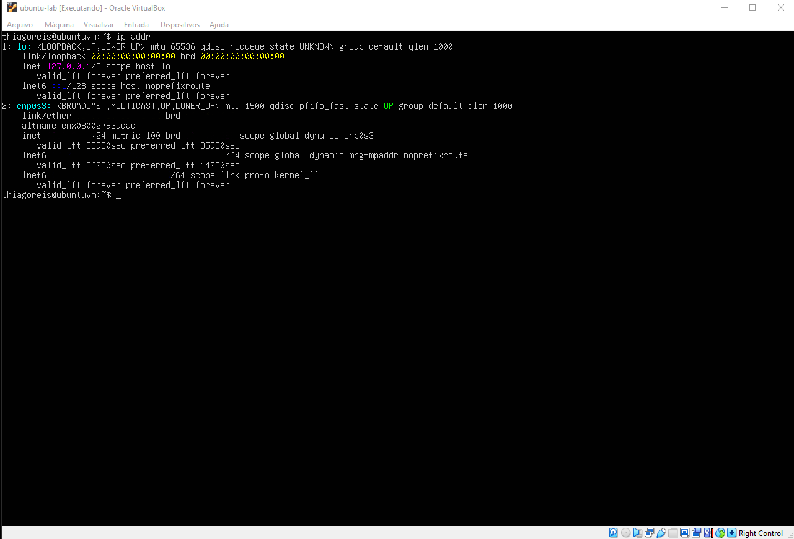
<p align="right"><i>(Imagem 54: Verificando a rede do Ubuntu Server no terminal)</i>

<br></br>

Também podemos testar a comunicação com a internet usando o comando `ping`:

```bash
ping -c 4 ubuntu.com
```

Se houver resposta aos pacotes enviados, a máquina virtual tem conectividade com a internet.

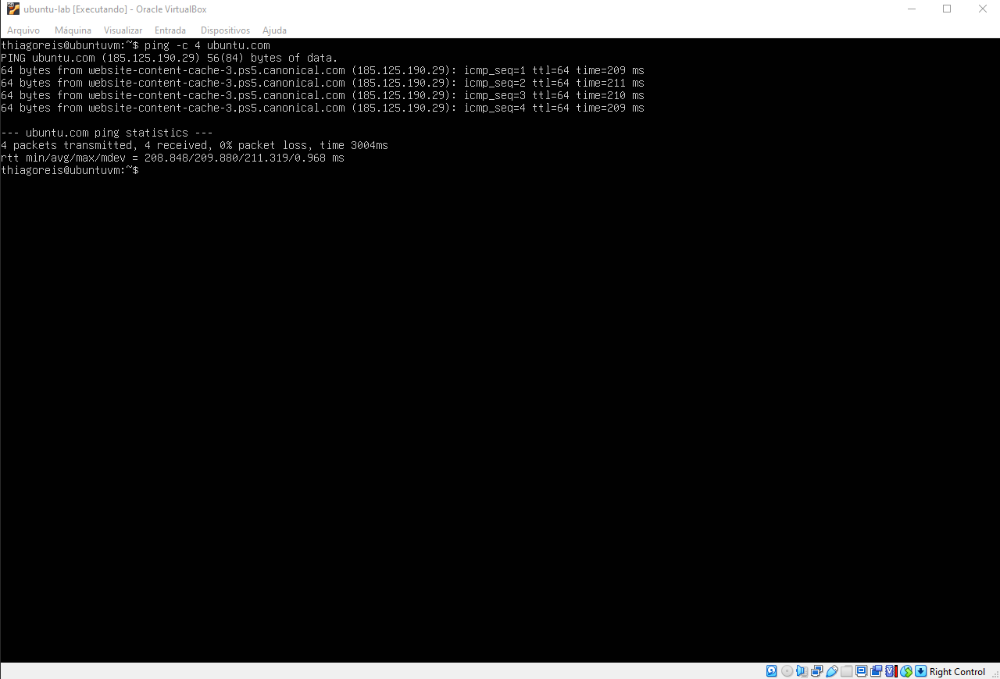
<p align="right"><i>(Imagem 55: Teste de ping no terminal do Ubuntu Server)</i>

---

<br></br>

## Entendendo o ambiente criado

Depois de concluir todas as etapas, temos um computador físico executando Windows como sistema principal. Dentro do Windows está instalado o Oracle VirtualBox, responsável pela camada de virtualização. O VirtualBox disponibiliza recursos virtuais para a máquina, incluindo processador, memória, armazenamento e interface de rede. Dentro dessa máquina virtual está instalado o Ubuntu Server.

A estrutura final do projeto fica assim:

```
Computador físico
       |
       +-- Windows
              |
              +-- VirtualBox
                     |
                     +-- CPU virtual
                     +-- Memória virtual
                     +-- Disco virtual
                     +-- Interface de rede virtual
                     |
                     +-- Ubuntu Server
                            |
                            +-- Sistema operacional
                            +-- Usuário
                            +-- Rede
                            +-- Armazenamento
```

---

<br></br>

## Resultado

Ao final deste laboratório, temos uma máquina virtual com o sistema operacional Ubuntu Server funcionando dentro do Windows por meio do Oracle VirtualBox.

O ambiente criado pode ser usado como base para outros estudos relacionados à administração de sistemas, redes, servidores, containers e DevOps.

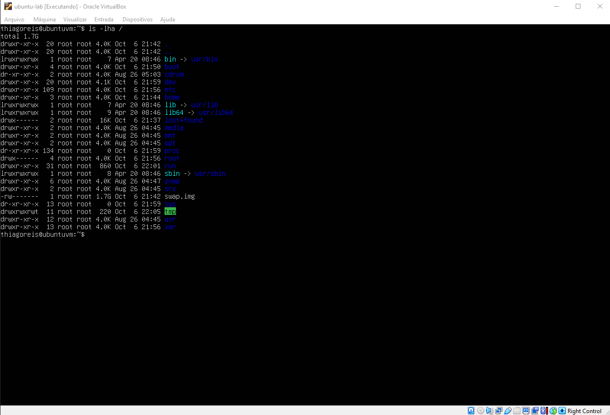
<p align="right"><i>(Imagem 56: Representação do sistema operacional Ubuntu Server)</i>

---

<br></br>

## Utilizando a máquina virtual como laboratório

Uma das principais vantagens desse ambiente é a possibilidade de usar a máquina virtual para fazer experimentos sem modificar diretamente o sistema operacional principal.

A partir do Ubuntu Server instalado, podemos criar diferentes cenários de estudo:

- Administração de sistemas Linux
- Configuração de usuários e permissões
- Gerenciamento de serviços
- Configuração de redes
- Instalação de servidores
- Docker e containers
- Nginx
- PHP
- MariaDB
- Redis
- OpenSearch
- Magento 2
- Automação e práticas de DevOps

Também é possível criar snapshots da máquina virtual antes de fazer alterações importantes. Assim, um estado anterior do laboratório pode ser recuperado caso alguma configuração apresente problemas.

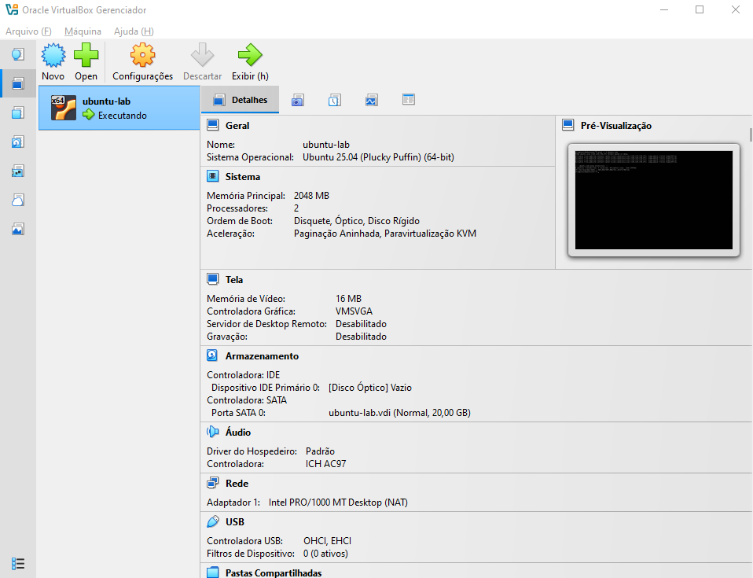
<p align="right"><i>(Imagem 57: Painel principal do Oracle VirtualBox para gerenciamento das máquinas virtuais)</i>

---

<br></br>

## Considerações

A criação de máquinas virtuais é uma das formas mais práticas de montar ambientes para estudos e testes usando um único computador físico.

Neste laboratório, instalamos o Oracle VirtualBox no Windows, criamos uma máquina virtual, definimos os recursos de hardware virtual, configuramos a rede e instalamos o Ubuntu Server.

O resultado é um ambiente Linux isolado que pode ser usado para desenvolver conhecimentos em infraestrutura e experimentar diferentes tecnologias.

Além de facilitar os estudos, a virtualização permite reproduzir ambientes, testar configurações e entender melhor a relação entre sistema operacional, hardware, rede e serviços.

---

<br></br>

## Referências

- [Oracle VirtualBox Downloads](https://www.virtualbox.org/wiki/Downloads)
- [Oracle VirtualBox Documentation](https://www.virtualbox.org/manual/)
- [Oracle VirtualBox Installation Guide](https://www.virtualbox.org/manual/ch01.html)
- [Ubuntu Server Downloads](https://ubuntu.com/download/server)
